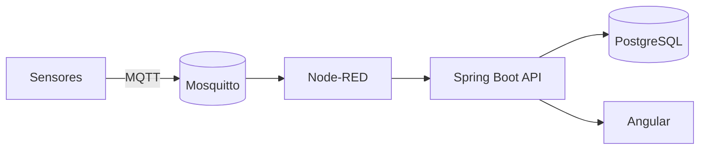

# Glea Nexo

**Plataforma IoT para Agricultura 4.0**

Sistema IoT agrícola con edge (Mosquitto/Node-RED/Python), backend Spring Boot y frontend Angular.

***

## Tabla de Contenidos

- [Visión](#visión)
- [Arquitectura](#arquitectura)
- [Stack Tecnológico](#stack-tecnológico)
- [Inicio Rápido](#inicio-rápido)
- [Servicios y Puertos](#servicios-y-puertos)
- [Inventario (CRUD)](#inventario-crud)
- [OpenAPI / Swagger](#openapi--swagger)
- [Testing](#testing)
- [Documentación](#documentación)
- [Roadmap](#roadmap)

***

## Visión

Glea Nexo permite monitoreo de sensores, ingestión de telemetría y gestión de inventario operativo (`farm`, `zone`, `device`) con scoping por organización.

## Arquitectura



## Stack Tecnológico

- Backend: Spring Boot **3.5.0**, Java 21, Spring Data JPA, Flyway
- Frontend: Angular 17 (modo dev)
- Edge: Mosquitto 2.x, Node-RED 3.1, Python 3.11
- Infra: Docker Compose v2

***

## Inicio Rápido

### Prerrequisitos

- Docker Desktop + Docker Compose v2
- PowerShell

### Comandos (PowerShell)

```powershell
# Build plataforma
docker compose -f infra/compose/docker-compose.platform.yml build

# Levantar edge + platform
docker compose `
  -f infra/compose/docker-compose.edge.yml `
  -f infra/compose/docker-compose.platform.yml `
  up -d

# Estado
docker compose `
  -f infra/compose/docker-compose.edge.yml `
  -f infra/compose/docker-compose.platform.yml `
  ps
```

### Checks rápidos

```powershell
Invoke-WebRequest -Uri http://localhost:8080/actuator/health -UseBasicParsing
Invoke-WebRequest -Uri http://localhost:8080/api/ping -UseBasicParsing
Invoke-WebRequest -Uri http://localhost:4200 -UseBasicParsing

docker compose -f infra/compose/docker-compose.edge.yml exec mosquitto `
  mosquitto_sub -h localhost -t '$SYS/broker/uptime' -C 1 -v
```

## Servicios y Puertos

- Backend: `http://localhost:8080` (interno contenedor `8081`)
- Frontend: `http://localhost:4200`
- Node-RED: `http://localhost:1880`
- Mosquitto: `mqtt://localhost:1883`
- PostgreSQL host: `localhost:3608`

***

## Inventario (CRUD)

### Header de organización

- Header opcional: `X-Org-Code`
- Si falta: usa organización `default`
- Si no existe: `404 NOT_FOUND`

### Endpoints principales

- Farms
  - `POST /api/farms`
  - `GET /api/farms?page&size&sort&q?`
  - `GET /api/farms/{farmId}`
  - `PUT /api/farms/{farmId}`
  - `DELETE /api/farms/{farmId}`
- Zones
  - `POST /api/farms/{farmId}/zones`
  - `GET /api/farms/{farmId}/zones?page&size&sort&q?`
  - `GET /api/zones/{zoneId}`
  - `PUT /api/zones/{zoneId}`
  - `DELETE /api/zones/{zoneId}`
- Devices
  - `POST /api/zones/{zoneId}/devices`
  - `GET /api/devices?page&size&sort&farmId?&zoneId?&state?&q?`
  - `GET /api/devices/{deviceId}`
  - `PUT /api/devices/{deviceId}`
  - `DELETE /api/devices/{deviceId}`

Regla de contrato: `deviceUid` es inmutable después de creación.  
`PUT /api/devices/{deviceId}` solo permite actualizar `name` y `state`.

### Ejemplo PowerShell

```powershell
$farmBody = @{ code='finca-demo'; name='Finca Demo' } | ConvertTo-Json
Invoke-WebRequest -Method POST `
  -Uri http://localhost:8080/api/farms `
  -Headers @{ 'Content-Type'='application/json'; 'X-Org-Code'='default'; 'X-Correlation-Id'='demo-001' } `
  -Body $farmBody
```

### Ejemplo curl

```bash
curl -X POST http://localhost:8080/api/farms \
  -H 'Content-Type: application/json' \
  -H 'X-Org-Code: default' \
  -d '{"code":"finca-curl","name":"Finca Curl"}'
```

### Ejemplo PUT Device (sin deviceUid)

```bash
curl -X PUT http://localhost:8080/api/devices/<DEVICE_ID> \
  -H 'Content-Type: application/json' \
  -H 'X-Org-Code: default' \
  -d '{"name":"Gateway Renombrado","state":"ONLINE"}'
```

### Status codes

- `201` creación
- `200` lectura/actualización/listado
- `204` borrado
- `400` validación
- `404` no encontrado
- `409` conflicto de constraint
- `500` error interno

***

## OpenAPI / Swagger

- OpenAPI JSON: `http://localhost:8080/v3/api-docs`
- Swagger UI: `http://localhost:8080/swagger-ui/index.html`

***

## Testing

```powershell
cd backend
mvn test
```

Incluye tests de integración con Testcontainers para ingest y CRUD de inventario.

***

## Documentación

- Operación base: `agents.md`
- Runbook Inventario: `docs/runbook/inventory-crud.md`
- API Inventario: `docs/api/inventory-openapi.md`
- Iteración inventario: `docs/iterations/ITER-003-inventory-crud.md`
- Iteración ingest (previa): `docs/impl/ITER-001-ingest-event-dedupe.md`

***

## Roadmap

- ✅ ITER-001: ingest event + deduplicación
- ✅ ITER-002: persistencia de telemetría
- ✅ ITER-003: inventory CRUD (farm/zone/device)
- ⏭️ Siguiente: históricos, alertas y seguridad JWT+roles

***

**Última actualización:** 15/02/2026
