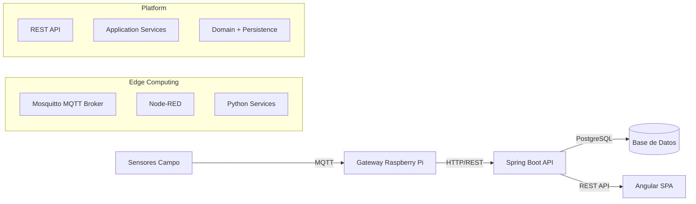
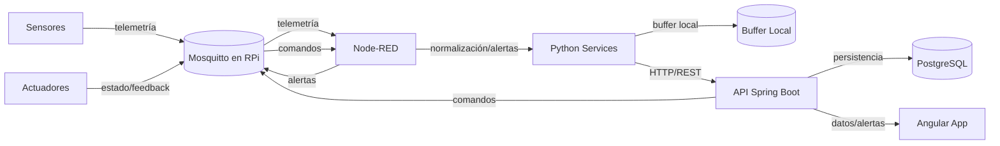
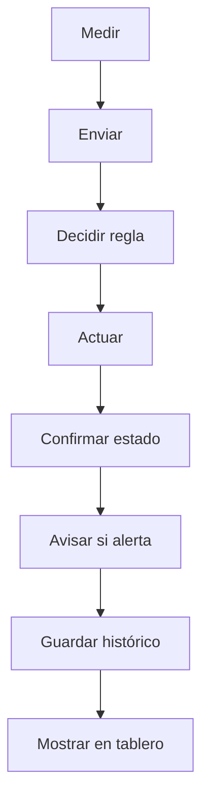
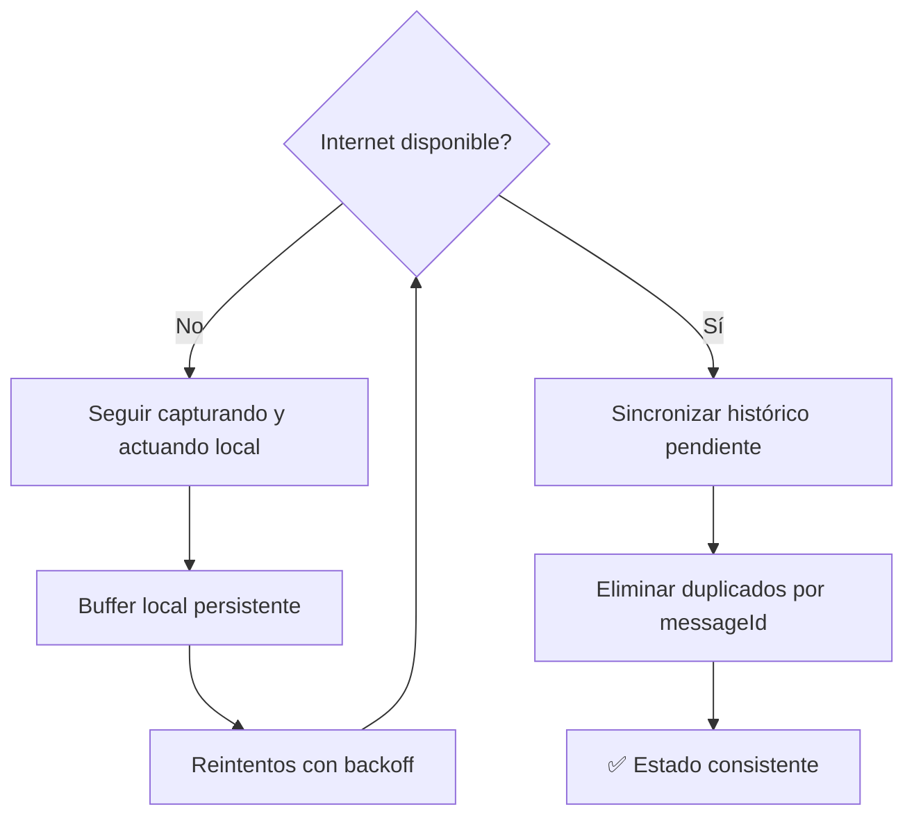
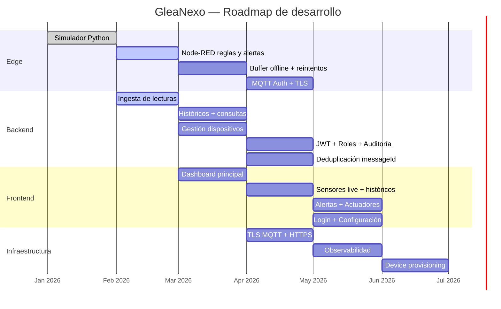

# Glea Nexo

**Plataforma IoT para Agricultura 4.0**

Sistema de automatización y gestión inteligente de plantaciones mediante sensores, actuadores y análisis de datos casi en tiempo real.

***

## Tabla de Contenidos

- [Visión del Proyecto](#visión-del-proyecto)
- [Arquitectura](#arquitectura)
- [Stack Tecnológico](#stack-tecnológico)
- [Inicio Rápido](#inicio-rápido)
- [Estructura del Proyecto](#estructura-del-proyecto)
- [Desarrollo](#desarrollo)
- [Testing](#testing)
- [Despliegue](#despliegue)
- [Documentación](#documentación)
- [Roadmap](#roadmap)
- [Contribución](#contribución)

***

## Visión del Proyecto

Glea Nexo aborda la operación agrícola conectada con arquitectura edge + plataforma:

- **Monitoreo casi en tiempo real:** sensores de temperatura, humedad, pH, luz, etc.
- **Control operacional:** base para comandos de actuadores por MQTT.
- **Gestión por contexto:** convenciones por finca/zona para operación multi-ubicación.
- **Histórico y analítica:** persistencia de ingesta y telemetría para dashboards y reglas.

### Casos de Uso Principales

1. **Riego inteligente:** sensores de humedad y control de válvulas.
2. **Clima de invernadero:** sensores ambientales y automatización de ventilación.
3. **Monitoreo multi-finca:** unificación de operación por tópicos MQTT.
4. **Alertamiento operativo:** detección de umbrales y eventos críticos.

***

## Arquitectura

### Arquitectura General



### Patrones de Diseño

- **Edge-First:** decisiones locales y resiliencia por broker MQTT.
- **DDD (en backend):** separación por dominio y repositorios.
- **Event-Driven:** intercambio desacoplado por tópicos MQTT.
- **Idempotencia:** deduplicación por `messageId` en ingesta.

***

## Stack Tecnológico

### Backend

- Spring Boot 3.3.4
- Java 21
- Spring Data JPA / Hibernate 6
- PostgreSQL (compose usa imagen 15)
- Tests: JUnit 5 + Testcontainers PostgreSQL

### Frontend

- Angular (modo DEV con `ng serve` en contenedor)
- RxJS
- Librería UI: pendiente de definición

### Edge

- Mosquitto 2.x
- Node-RED 3.1
- Python 3.11 (contenedor `edge-python`)

### DevOps

- Docker + Docker Compose v2
- Orquestación local por archivos compose separados (edge/platform)

***

## Inicio Rápido

### Prerrequisitos

- Docker Desktop + Docker Compose v2
- PowerShell 7+ (Windows) o shell equivalente
- Git

### Instalación en 3 pasos

```powershell
# 1. Clonar repositorio
git clone https://github.com/glea-digital/glea-nexo.git
cd glea-nexo

# 2. Build servicios plataforma
docker compose -f infra/compose/docker-compose.platform.yml build

# 3. Levantar edge + plataforma
docker compose `
  -f infra/compose/docker-compose.edge.yml `
  -f infra/compose/docker-compose.platform.yml `
  up -d
```

### Verificación rápida

```powershell
# Backend health (host)
Invoke-WebRequest -Uri http://localhost:8080/actuator/health -UseBasicParsing

# Backend ping
Invoke-WebRequest -Uri http://localhost:8080/api/ping -UseBasicParsing

# Frontend
Invoke-WebRequest -Uri http://localhost:4200 -UseBasicParsing

# MQTT broker
docker compose -f infra/compose/docker-compose.edge.yml exec mosquitto `
  mosquitto_sub -h localhost -t '$SYS/broker/uptime' -C 1 -v
```

**URLs de acceso:**

- Frontend: http://localhost:4200
- Backend API: http://localhost:8080/api
- Node-RED: http://localhost:1880
- PostgreSQL: `localhost:3608` (`glea/glea_123`, DB `glea_nexo`)

***

## Estructura del Proyecto

```text
glea-nexo/
├── backend/
│   ├── src/main/java/com/glea/nexo/
│   │   ├── api/
│   │   ├── application/
│   │   ├── domain/
│   │   └── config/
│   ├── src/main/resources/
│   │   └── db/migration/
│   └── src/test/
├── frontend/
├── edge/
│   ├── mosquitto/
│   ├── nodered/
│   └── python/services/
├── infra/compose/
│   ├── docker-compose.edge.yml
│   └── docker-compose.platform.yml
├── docs/
│   ├── diagrams/
│   ├── impl/
│   ├── requirements/
│   └── runbook/
└── agents.md
```

***

## Desarrollo

### Backend

```powershell
cd backend
mvn clean compile
mvn test
mvn spring-boot:run
```

Convenciones relevantes:

- Transacciones de ingesta por item con `REQUIRES_NEW`.
- Logging: `INFO` para eventos/deduplicados, `ERROR` para fallos.
- DTOs de ingesta en `api/dto/ingest`.

### Frontend

```powershell
cd frontend
npm install
npm run start
npm run build
```

### Edge

```powershell
# Node-RED
# http://localhost:1880

# Logs edge
docker compose -f infra/compose/docker-compose.edge.yml logs -f
```

***

## Testing

### Unit/Integración Backend

```powershell
cd backend
mvn test
mvn -Dtest=IngestControllerIntegrationTest test
```

### Frontend

```powershell
cd frontend
npm test
```

### E2E funcional (manual)

Actualmente no existe script versionado `backend/scripts/validate-iter-002.ps1`.  
Usar comandos del runbook en `agents.md` y queries SQL para validar persistencia.

***

## Despliegue

### Local

```powershell
docker compose `
  -f infra/compose/docker-compose.edge.yml `
  -f infra/compose/docker-compose.platform.yml `
  up -d
```

### Notas operativas actuales

- Backend escucha **8081** dentro del contenedor y se publica en **8080** en host (`8080:8081`).
- Ajuste recomendado: healthcheck del backend debe apuntar a `localhost:8081` dentro del contenedor.

***

## Documentación

| Documento | Ubicación | Descripción |
|---|---|---|
| Operación del repo | `agents.md` | Fuente de verdad operativa |
| ITER-001 | `docs/impl/ITER-001-ingest-event-dedupe.md` | Persistencia y dedupe de `IngestEvent` |
| ITER-002 | `backend/docs/impl/ITER-002-telemetry-persistence.md` | Persistencia completa de telemetría |
| Backend runbook | `docs/runbook/backend-scaffold-spring-iot-explicado.md` | Estado backend y guía |
| Requisitos | `docs/requirements/Requisitos de IoT Agrícola con MQTT y Raspberry Pi.pdf` | Requisitos funcionales/técnicos |

***

## Roadmap

### ✅ ITER-001 (Completado)

- Persistencia `IngestEvent`
- Deduplicación por dispositivo + `messageId`
- Endpoint batch `/api/ingest/readings/batch`

### ⚠️ ITER-002 (Implementado en código/tests, despliegue por alinear)

- Persistencia `TelemetryReading`
- Actualización de estado `Sensor` (`ONLINE`, `lastSeenAt`, batería, RSSI)
- Catálogo `sensor_type` y `unit`

### 🗓️ ITER-003 (Próximo)

- API de históricos (`GET /api/telemetry`)
- Dashboard Angular con series temporales
- Alertas por umbral
- Cálculo de `quality`

### 🗓️ ITER-004 (Planeado)

- API de control actuadores
- Flows Node-RED completos
- Modelo multi-sensor por gateway

***

## Contribución

### Workflow Git

```bash
git checkout -b feat/ITER-00X-descripcion
git commit -m "feat(ingest): ..."
git push origin feat/ITER-00X-descripcion
```

### Prefijos de commit

- `feat:` nueva funcionalidad
- `fix:` corrección
- `refactor:` mejora interna sin cambio funcional
- `test:` pruebas
- `docs:` documentación
- `chore:` mantenimiento

### Checklist de review

- [ ] Build y tests OK
- [ ] Sin regresiones funcionales
- [ ] Logging y manejo de errores adecuados
- [ ] Documentación actualizada

***

## Contacto y Soporte

- Equipo: Glea Digital
- Canal interno: `#glea-nexo-dev`
- Gestión de incidencias: repositorio GitHub del proyecto

***

## Licencia

Licencia pendiente de definición por stakeholders.

***

**Última actualización:** 15/02/2026  
**Estado del proyecto:** MVP en desarrollo (~35% del roadmap macro)
=======
<p align="center">
  
</p>

<h1 align="center">GleaNexo — Plataforma IoT Agrícola</h1>

<p align="center">
  <strong>Monitoreo inteligente, alertas en tiempo real y control de actuadores para agricultura de precisión.</strong>
</p>

<p align="center">
  
  
  
  
  
  
  
  
</p>

---

## 📋 Tabla de contenidos

- [Acerca del proyecto](#-acerca-del-proyecto)
- [Arquitectura](#-arquitectura)
- [Stack tecnológico](#-stack-tecnológico)
- [Estructura del repositorio](#-estructura-del-repositorio)
- [Requisitos previos](#-requisitos-previos)
- [Instalación y arranque rápido](#-instalación-y-arranque-rápido)
- [Servicios y puertos](#-servicios-y-puertos)
- [Convención de tópicos MQTT](#-convención-de-tópicos-mqtt)
- [Validación end-to-end](#-validación-end-to-end)
- [Estado del desarrollo](#-estado-del-desarrollo)
- [Roadmap](#-roadmap)
- [Contribuir](#-contribuir)
- [Licencia](#-licencia)

---

## 🧭 Acerca del proyecto

**GleaNexo** es una plataforma IoT para agricultura de precisión que utiliza **MQTT** y una **Raspberry Pi** como gateway de borde. El sistema permite:

- **Monitoreo casi en tiempo real** de sensores agrícolas (humedad del suelo, temperatura, pH, EC, luminosidad, viento, lluvia, presión, batería).
- **Alertas inteligentes** basadas en umbrales y reglas configurables.
- **Control de actuadores** (válvulas, bombas, relés) con feedback de estado.
- **Multi-ubicación** — modelado por convención de tópicos `finca/zona` en MQTT.
- **Resiliencia offline** — captura y actuación local con sincronización posterior y deduplicación por `messageId`.
- **Históricos** para análisis y toma de decisiones.

> **Nota:** Este proyecto está en fase de desarrollo activo. Varias funcionalidades descritas están en proceso de implementación.

---

## 🏗 Arquitectura



### Flujo funcional



### Resiliencia offline



---

## 🛠 Stack tecnológico

| Capa | Tecnología | Versión |
|------|-----------|---------|
| **Backend API** | Spring Boot | 3.5.0 |
| **Runtime** | Java (Eclipse Temurin) | 21 |
| **Frontend** | Angular | 17.3 |
| **Base de datos** | PostgreSQL | 15 |
| **Broker MQTT** | Eclipse Mosquitto | 2.x |
| **Orquestación Edge** | Node-RED | 3.1 |
| **Servicios Edge** | Python | 3.11 |
| **Contenedores** | Docker + Docker Compose | v2 |

---

## 📁 Estructura del repositorio

```
glea-nexo/
├── backend/                       # API REST — Spring Boot
│   ├── Dockerfile                 # Build multi-stage (Maven + JRE 21)
│   ├── pom.xml                    # Dependencias Maven
│   └── src/
│       └── main/
│           ├── java/com/glea/nexo/
│           │   ├── Application.java
│           │   └── api/
│           │       └── PingController.java
│           └── resources/
│               └── application.properties
├── frontend/                      # UI — Angular 17 (standalone components)
│   ├── Dockerfile                 # Node 20 + ng serve
│   ├── angular.json
│   ├── package.json
│   └── src/
│       └── app/
│           └── app.component.ts
├── edge/                          # Capa de borde (gateway RPi)
│   ├── mosquitto/
│   │   ├── config/mosquitto.conf  # Configuración del broker MQTT
│   │   ├── data/                  # Persistencia Mosquitto
│   │   └── log/                   # Logs del broker
│   ├── nodered/
│   │   └── data/                  # Flows y configuración Node-RED
│   └── python/
│       └── services/
│           ├── requirements.txt   # paho-mqtt
│           └── simulator/
│               └── main.py        # Simulador de 10 sensores agrícolas
├── infra/
│   └── compose/
│       ├── docker-compose.edge.yml      # Mosquitto + Node-RED + Python
│       └── docker-compose.platform.yml  # PostgreSQL + Backend + Frontend
├── docs/
│   ├── diagrams/                  # Diagramas Mermaid
│   └── requirements/             # PDF de requisitos
├── agents.md                      # Documento operativo del repo
└── README.md
```

---

## ✅ Requisitos previos

| Requisito | Versión mínima |
|-----------|---------------|
| [Docker Desktop](https://www.docker.com/products/docker-desktop/) | 4.x |
| Docker Compose | v2 |
| PowerShell | 5.1+ (Windows) |

> 💡 No se necesita instalar Java, Node.js, ni Python localmente — todo corre en contenedores Docker.

---

## 🔌 Servicios y puertos

| Servicio | Puerto | URL local | Healthcheck |
|----------|--------|-----------|-------------|
| **Mosquitto** | `1883` | `mqtt://localhost:1883` | `mosquitto_sub -t '$SYS/broker/uptime'` |
| **Node-RED** | `1880` | [http://localhost:1880](http://localhost:1880) | `GET /` |
| **Backend API** | `8080` | [http://localhost:8080](http://localhost:8080) | `GET /actuator/health` |
| **Frontend** | `4200` | [http://localhost:4200](http://localhost:4200) | `GET /` |
| **PostgreSQL** | `3608` | `postgres://localhost:3608` | `pg_isready -U glea -d glea_nexo` |

---

## 📡 Convención de tópicos MQTT

```
agro/{fincaId}/{zonaId}/sensor/{tipo}/telemetry    # Datos de sensores
agro/{fincaId}/{zonaId}/sensor/{tipo}/status        # Estado del sensor (online/offline)
agro/{fincaId}/{zonaId}/actuator/{tipo}/cmd          # Comandos a actuadores
agro/{fincaId}/{zonaId}/actuator/{tipo}/state        # Estado del actuador
agro/{fincaId}/{zonaId}/alerts                       # Alertas
```

### Ejemplo de payload de telemetría

```json
{
  "deviceId": "temp-01",
  "sensorId": "temperature-01",
  "type": "temperature",
  "ts": "2026-02-06T12:00:00Z",
  "value": 23.4,
  "unit": "C",
  "battery": 4.05,
  "quality": "good",
  "messageId": "550e8400-e29b-41d4-a716-446655440000"
}
```

### QoS y retain recomendados

| Tópico | QoS | Retain | Notas |
|--------|-----|--------|-------|
| Telemetría | 1 | `false` | Datos en flujo |
| Status sensor | 1 | `true` | Último estado conocido |
| Comando actuador | 1–2 | `false` | Entrega garantizada |
| Estado actuador | 1 | `true` | Último estado conocido |
| Alertas | 1 | `false` | Notificación inmediata |


## 📈 Estado del desarrollo

> 🚧 **Proyecto en desarrollo activo**

### Capa Edge

| Componente | Estado | Descripción |
|:-----------|:------:|:------------|
| Broker Mosquitto | ✅ Listo | Configurado con persistencia y logs |
| Node-RED — Ingesta MQTT | ✅ Básico | Suscripción a `agro/#` con debug |
| Node-RED — Reglas y alertas | 🔲 Pendiente | Reglas por umbral/horario |
| Node-RED — Control actuadores | 🔲 Pendiente | Feedback loop |
| Node-RED — Buffer offline | 🔲 Pendiente | Reintentos con backoff hacia backend |
| Node-RED — Envío HTTP | 🔲 Pendiente | POST hacia API REST |
| Simulador Python | ✅ Listo | 10 tipos de sensores, LWT, `messageId` UUID |
| MQTT Auth + ACL | 🔲 Pendiente | Actualmente `allow_anonymous true` |

### Backend (Spring Boot)

| Componente | Estado | Descripción |
|:-----------|:------:|:------------|
| API `/api/ping` | ✅ Listo | Health check básico |
| Actuator `/actuator/health` | ✅ Listo | Probes habilitados |
| Spring Boot 3.5 | ✅ Listo | Actualizado a v3.5.0 con Java 21 |
| Ingesta de lecturas | 🔲 Pendiente | Endpoint para recibir telemetría |
| Consulta de históricos | 🔲 Pendiente | Queries por rango, sensor, zona |
| Gestión de dispositivos | 🔲 Pendiente | CRUD de sensores y actuadores |
| Gestión de alertas | 🔲 Pendiente | Configuración y consulta |
| Gestión de comandos | 🔲 Pendiente | Envío y tracking de comandos |
| Seguridad JWT + Roles | 🔲 Pendiente | `ADMIN`, `OPERATOR`, `VIEWER` |
| Audit log | 🔲 Pendiente | Registro de acciones por usuario |
| Deduplicación `messageId` | 🔲 Pendiente | Idempotencia en ingesta |

### Frontend (Angular)

| Componente | Estado | Descripción |
|:-----------|:------:|:------------|
| App Angular scaffold | ✅ Listo | Angular 17 standalone, hot reload |
| Login / Autenticación | 🔲 Pendiente | Integración con JWT |
| Overview finca/zona | 🔲 Pendiente | Dashboard principal |
| Detalle sensor | 🔲 Pendiente | Datos live + históricos |
| Panel de alertas | 🔲 Pendiente | Lista y gestión |
| Control de actuadores | 🔲 Pendiente | UI con feedback |
| Configuración | 🔲 Pendiente | Umbrales, usuarios, zonas |

### Infraestructura y seguridad

| Componente | Estado | Descripción |
|:-----------|:------:|:------------|
| Docker Compose Edge | ✅ Listo | Mosquitto + Node-RED + Python |
| Docker Compose Platform | ✅ Listo | PostgreSQL + Backend + Frontend |
| TLS/HTTPS | 🔲 Pendiente | Certificados para MQTT y HTTP |
| Backup PostgreSQL | 🔲 Pendiente | Estrategia de respaldos |
| Observabilidad | 🔲 Pendiente | Métricas, logs, tracing |

---

## 🗺 Roadmap



### Objetivos futuros (demo → piloto)

- Offline robusto con replay y deduplicación completa
- TLS MQTT + gestión de certificados
- Device provisioning automático
- OTA / gestión remota del gateway
- Observabilidad (métricas, logs, tracing distribuido)

---

## 📄 Licencia

Este proyecto es de uso privado. Consulta con los mantenedores para más información.

---

<p align="center">
  Hecho con 💚 por RafaLopezZz para nuestra agricultura
</p>
>>>>>>> fbd19c42112f763065037a04a38556116332ab65
