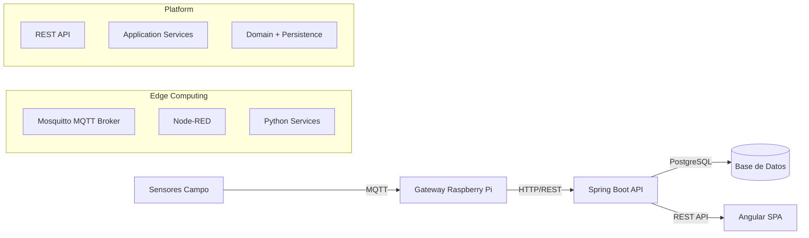

# Glea Nexo

**Plataforma IoT para Agricultura 4.0**

Sistema de automatización y gestión inteligente de plantaciones mediante sensores, actuadores y análisis de datos casi en tiempo real.

***

## Tabla de Contenidos

- [Visión del Proyecto](#visión-del-proyecto)
- [Arquitectura](#arquitectura)
- [Stack Tecnológico](#stack-tecnológico)
- [Inicio Rápido](#inicio-rápido)
- [Estructura del Proyecto](#estructura-del-proyecto)
- [Desarrollo](#desarrollo)
- [Testing](#testing)
- [Despliegue](#despliegue)
- [Documentación](#documentación)
- [Roadmap](#roadmap)
- [Contribución](#contribución)

***

## Visión del Proyecto

Glea Nexo aborda la operación agrícola conectada con arquitectura edge + plataforma:

- **Monitoreo casi en tiempo real:** sensores de temperatura, humedad, pH, luz, etc.
- **Control operacional:** base para comandos de actuadores por MQTT.
- **Gestión por contexto:** convenciones por finca/zona para operación multi-ubicación.
- **Histórico y analítica:** persistencia de ingesta y telemetría para dashboards y reglas.

### Casos de Uso Principales

1. **Riego inteligente:** sensores de humedad y control de válvulas.
2. **Clima de invernadero:** sensores ambientales y automatización de ventilación.
3. **Monitoreo multi-finca:** unificación de operación por tópicos MQTT.
4. **Alertamiento operativo:** detección de umbrales y eventos críticos.

***

## Arquitectura

### Arquitectura General



### Patrones de Diseño

- **Edge-First:** decisiones locales y resiliencia por broker MQTT.
- **DDD (en backend):** separación por dominio y repositorios.
- **Event-Driven:** intercambio desacoplado por tópicos MQTT.
- **Idempotencia:** deduplicación por `messageId` en ingesta.

***

## Stack Tecnológico

### Backend

- Spring Boot 3.3.4
- Java 21
- Spring Data JPA / Hibernate 6
- PostgreSQL (compose usa imagen 15)
- Tests: JUnit 5 + Testcontainers PostgreSQL

### Frontend

- Angular (modo DEV con `ng serve` en contenedor)
- RxJS
- Librería UI: pendiente de definición

### Edge

- Mosquitto 2.x
- Node-RED 3.1
- Python 3.11 (contenedor `edge-python`)

### DevOps

- Docker + Docker Compose v2
- Orquestación local por archivos compose separados (edge/platform)

***

## Inicio Rápido

### Prerrequisitos

- Docker Desktop + Docker Compose v2
- PowerShell 7+ (Windows) o shell equivalente
- Git

### Instalación en 3 pasos

```powershell
# 1. Clonar repositorio
git clone https://github.com/glea-digital/glea-nexo.git
cd glea-nexo

# 2. Build servicios plataforma
docker compose -f infra/compose/docker-compose.platform.yml build

# 3. Levantar edge + plataforma
docker compose `
  -f infra/compose/docker-compose.edge.yml `
  -f infra/compose/docker-compose.platform.yml `
  up -d
```

### Verificación rápida

```powershell
# Backend health (host)
Invoke-WebRequest -Uri http://localhost:8080/actuator/health -UseBasicParsing

# Backend ping
Invoke-WebRequest -Uri http://localhost:8080/api/ping -UseBasicParsing

# Frontend
Invoke-WebRequest -Uri http://localhost:4200 -UseBasicParsing

# MQTT broker
docker compose -f infra/compose/docker-compose.edge.yml exec mosquitto `
  mosquitto_sub -h localhost -t '$SYS/broker/uptime' -C 1 -v
```

**URLs de acceso:**

- Frontend: http://localhost:4200
- Backend API: http://localhost:8080/api
- Node-RED: http://localhost:1880
- PostgreSQL: `localhost:3608` (`glea/glea_123`, DB `glea_nexo`)

***

## Estructura del Proyecto

```text
glea-nexo/
├── backend/
│   ├── src/main/java/com/glea/nexo/
│   │   ├── api/
│   │   ├── application/
│   │   ├── domain/
│   │   └── config/
│   ├── src/main/resources/
│   │   └── db/migration/
│   └── src/test/
├── frontend/
├── edge/
│   ├── mosquitto/
│   ├── nodered/
│   └── python/services/
├── infra/compose/
│   ├── docker-compose.edge.yml
│   └── docker-compose.platform.yml
├── docs/
│   ├── diagrams/
│   ├── impl/
│   ├── requirements/
│   └── runbook/
└── agents.md
```

***

## Desarrollo

### Backend

```powershell
cd backend
mvn clean compile
mvn test
mvn spring-boot:run
```

Convenciones relevantes:

- Transacciones de ingesta por item con `REQUIRES_NEW`.
- Logging: `INFO` para eventos/deduplicados, `ERROR` para fallos.
- DTOs de ingesta en `api/dto/ingest`.

### Frontend

```powershell
cd frontend
npm install
npm run start
npm run build
```

### Edge

```powershell
# Node-RED
# http://localhost:1880

# Logs edge
docker compose -f infra/compose/docker-compose.edge.yml logs -f
```

***

## Testing

### Unit/Integración Backend

```powershell
cd backend
mvn test
mvn -Dtest=IngestControllerIntegrationTest test
```

### Frontend

```powershell
cd frontend
npm test
```

### E2E funcional (manual)

Actualmente no existe script versionado `backend/scripts/validate-iter-002.ps1`.  
Usar comandos del runbook en `agents.md` y queries SQL para validar persistencia.

***

## Despliegue

### Local

```powershell
docker compose `
  -f infra/compose/docker-compose.edge.yml `
  -f infra/compose/docker-compose.platform.yml `
  up -d
```

### Notas operativas actuales

- Backend escucha **8081** dentro del contenedor y se publica en **8080** en host (`8080:8081`).
- Ajuste recomendado: healthcheck del backend debe apuntar a `localhost:8081` dentro del contenedor.

***

## Documentación

| Documento | Ubicación | Descripción |
|---|---|---|
| Operación del repo | `agents.md` | Fuente de verdad operativa |
| ITER-001 | `docs/impl/ITER-001-ingest-event-dedupe.md` | Persistencia y dedupe de `IngestEvent` |
| ITER-002 | `backend/docs/impl/ITER-002-telemetry-persistence.md` | Persistencia completa de telemetría |
| Backend runbook | `docs/runbook/backend-scaffold-spring-iot-explicado.md` | Estado backend y guía |
| Requisitos | `docs/requirements/Requisitos de IoT Agrícola con MQTT y Raspberry Pi.pdf` | Requisitos funcionales/técnicos |

***

## Roadmap

### ✅ ITER-001 (Completado)

- Persistencia `IngestEvent`
- Deduplicación por dispositivo + `messageId`
- Endpoint batch `/api/ingest/readings/batch`

### ⚠️ ITER-002 (Implementado en código/tests, despliegue por alinear)

- Persistencia `TelemetryReading`
- Actualización de estado `Sensor` (`ONLINE`, `lastSeenAt`, batería, RSSI)
- Catálogo `sensor_type` y `unit`

### 🗓️ ITER-003 (Próximo)

- API de históricos (`GET /api/telemetry`)
- Dashboard Angular con series temporales
- Alertas por umbral
- Cálculo de `quality`

### 🗓️ ITER-004 (Planeado)

- API de control actuadores
- Flows Node-RED completos
- Modelo multi-sensor por gateway

***

## Contribución

### Workflow Git

```bash
git checkout -b feat/ITER-00X-descripcion
git commit -m "feat(ingest): ..."
git push origin feat/ITER-00X-descripcion
```

### Prefijos de commit

- `feat:` nueva funcionalidad
- `fix:` corrección
- `refactor:` mejora interna sin cambio funcional
- `test:` pruebas
- `docs:` documentación
- `chore:` mantenimiento

### Checklist de review

- [ ] Build y tests OK
- [ ] Sin regresiones funcionales
- [ ] Logging y manejo de errores adecuados
- [ ] Documentación actualizada

***

## Contacto y Soporte

- Equipo: Glea Digital
- Canal interno: `#glea-nexo-dev`
- Gestión de incidencias: repositorio GitHub del proyecto

***

## Licencia

Licencia pendiente de definición por stakeholders.

***

**Última actualización:** 15/02/2026  
**Estado del proyecto:** MVP en desarrollo (~35% del roadmap macro)
