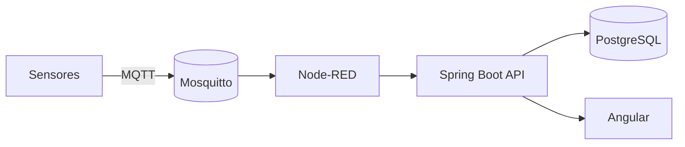

# Glea Nexo

**Plataforma IoT para agricultura conectada, operativa incluso con conectividad irregular.**

Glea Nexo es una plataforma IoT agrícola orientada a monitorización, trazabilidad operativa y evolución progresiva hacia automatización e inteligencia aplicada.
Combina una capa **edge** (Mosquitto, Node-RED, Python, SQLite) con una **plataforma** (Spring Boot, PostgreSQL, Angular) para capturar telemetría, estructurar inventario operativo y construir una experiencia de observabilidad útil por finca, zona y dispositivo.

---

## Qué es Glea Nexo

El objetivo de Glea Nexo no es ser una demo genérica de IoT, sino una base realista para casos de uso agrícolas donde importan:

- ingestión fiable de telemetría
- operación con edge/gateway local
- visibilidad por finca, zona y dispositivo
- trazabilidad de eventos y estados
- evolución posterior hacia alertas, automatización y ML cuando tenga sentido

---

## Estado actual del proyecto

### Base ya construida

- **Edge** con Mosquitto, Node-RED y servicios Python
- **Backend** Spring Boot con ingestión de telemetría y persistencia
- **Inventario operativo**: `farm`, `zone`, `device`
- **Scoping por organización**
- **Infraestructura Compose** para edge y plataforma
- **Documentación base de arquitectura e iteraciones**

### Iteraciones completadas

- ✅ **ITER-001** — ingest event + deduplicación
- ✅ **ITER-002** — persistencia de telemetría
- ✅ **ITER-003** — inventory CRUD (`farm`, `zone`, `device`)

### Iteración actual en foco

## Observabilidad operativa v1

La iteración activa del proyecto está orientada a cerrar una primera vertical de producto útil y demostrable:

- histórico de telemetría por zona/dispositivo
- snapshot operativo de estado actual
- alertas básicas visibles
- una interfaz mínima pero útil de observabilidad

### Qué entra en esta iteración

- consulta histórica
- lectura de último estado
- alertas simples
- frontend con filtros, gráfico y panel de alertas

### Qué NO entra todavía

- realtime con WebSocket/SSE
- seguridad completa JWT + roles
- motor complejo de reglas
- notificaciones externas
- capa ML/MLOps
- observabilidad avanzada de infraestructura

---

## Arquitectura


```mermaid
flowchart LR
  Sensors[Sensores] -->|MQTT| MQTT[(Mosquitto)]
  MQTT --> NR[Node-RED]
  NR --> API[Spring Boot API]
  API --> PG[(PostgreSQL)]
  API --> FE[Angular]
```

### Capas

- **Edge**: captura, transporte y preprocesado operativo
- **Backend**: dominio, persistencia, consultas y contratos API
- **Frontend**: visualización operativa y experiencia de uso
- **Infra**: arranque reproducible con Docker Compose

---

## Stack tecnológico

- **Backend:** Spring Boot 3.5.0, Java 21, Spring Data JPA, Flyway
- **Frontend:** Angular 17
- **Edge:** Mosquitto 2.x, Node-RED 3.1, Python 3.11, SQLite
- **Base de datos:** PostgreSQL
- **Infra:** Docker Compose v2

---

## Inicio rápido

### Prerrequisitos

- Docker Desktop + Docker Compose v2
- PowerShell

### Build plataforma

```powershell
docker compose -f infra/compose/docker-compose.platform.yml build
```

### Levantar edge + platform

```powershell
docker compose `
  -f infra/compose/docker-compose.edge.yml `
  -f infra/compose/docker-compose.platform.yml `
  up -d
```

### Ver estado

```powershell
docker compose `
  -f infra/compose/docker-compose.edge.yml `
  -f infra/compose/docker-compose.platform.yml `
  ps
```

---

## Checks rápidos

```powershell
Invoke-WebRequest -Uri http://localhost:8080/actuator/health -UseBasicParsing
Invoke-WebRequest -Uri http://localhost:8080/api/ping -UseBasicParsing
Invoke-WebRequest -Uri http://localhost:4200 -UseBasicParsing

docker compose -f infra/compose/docker-compose.edge.yml exec mosquitto `
  mosquitto_sub -h localhost -t '$SYS/broker/uptime' -C 1 -v
```

---

## Servicios y puertos

- **Backend:** `http://localhost:8080`
- **Frontend:** `http://localhost:4200`
- **Node-RED:** `http://localhost:1880`
- **Mosquitto:** `mqtt://localhost:1883`
- **PostgreSQL host:** `localhost:3608`

---

## API disponible hoy

### Inventario operativo

#### Header de organización

- Header opcional: `X-Org-Code`
- Si falta: usa organización `default`
- Si no existe: `404 NOT_FOUND`

#### Endpoints principales

- **Farms**
  - `POST /api/farms`
  - `GET /api/farms?page&size&sort&q?`
  - `GET /api/farms/{farmId}`
  - `PUT /api/farms/{farmId}`
  - `DELETE /api/farms/{farmId}`

- **Zones**
  - `POST /api/farms/{farmId}/zones`
  - `GET /api/farms/{farmId}/zones?page&size&sort&q?`
  - `GET /api/zones/{zoneId}`
  - `PUT /api/zones/{zoneId}`
  - `DELETE /api/zones/{zoneId}`

- **Devices**
  - `POST /api/zones/{zoneId}/devices`
  - `GET /api/devices?page&size&sort&farmId?&zoneId?&state?&q?`
  - `GET /api/devices/{deviceId}`
  - `PUT /api/devices/{deviceId}`
  - `DELETE /api/devices/{deviceId}`

### Contrato relevante actual

- `deviceUid` es inmutable después de creación
- `PUT /api/devices/{deviceId}` solo permite actualizar `name` y `state`

---

## Próxima API en construcción

Para la iteración **Observabilidad operativa v1**, el siguiente bloque de API se orienta a:

- histórico de lecturas
- snapshot operativo por zona
- alertas persistidas y consultables

A nivel de diseño, los contratos previstos son:

- `GET /api/readings`
- `GET /api/readings/series`
- `GET /api/zones/{zoneId}/snapshot`
- `GET /api/alerts`
- `POST /api/ingest/events` *(si se persisten eventos desde edge en esta fase)*

> Estos contratos forman parte del foco actual del proyecto y pueden ajustarse durante la iteración mientras se mantenga estable el objetivo funcional.

---

## OpenAPI / Swagger

- OpenAPI JSON: `http://localhost:8080/v3/api-docs`
- Swagger UI: `http://localhost:8080/swagger-ui/index.html`

---

## Testing

```powershell
cd backend
mvn test
```

Incluye base de testing para backend y validación de iteraciones previas.

---

## Documentación del repo

- Operación base: `agents.md`
- API inventario: `docs/api/inventory-openapi.md`
- Runbook inventario: `docs/runbook/inventory-crud.md`
- Iteraciones: `docs/iterations/`
- Diagramas: `docs/diagrams/`
- Roadmap ampliado: `roadmap.md`

---

## Roadmap inmediato

### Cerrado
- ✅ ingest + deduplicación
- ✅ persistencia de telemetría
- ✅ inventory CRUD

### En foco ahora
- ⏭️ histórico por zona/dispositivo
- ⏭️ snapshot operativo
- ⏭️ alertas básicas
- ⏭️ frontend de observabilidad

### Después
- seguridad JWT + roles
- control de actuadores más sólido
- automatización basada en reglas
- IA/ML solo cuando el caso de uso y los datos lo justifiquen

---

## Posicionamiento del proyecto

Glea Nexo no busca parecer complejo: busca parecer útil.

La prioridad actual no es meter más piezas, sino cerrar una vertical demostrable de producto:
**ver qué está pasando, dónde está pasando y cuándo requiere atención.**

---

**Última actualización:** 2026-03-29
