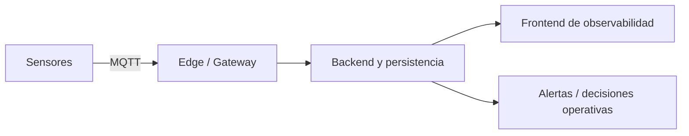

# Glea Nexo

**Plataforma IoT agrícola orientada a observabilidad operativa, trazabilidad y evolución progresiva hacia automatización útil en campo.**

Glea Nexo nace para resolver un problema muy concreto: en entornos agrícolas reales, los datos existen, pero suelen llegar dispersos, tarde, sin contexto operativo claro y con una conectividad que no siempre acompaña. El resultado habitual es una operación reactiva, con poca capacidad para entender qué está pasando, dónde ocurre y cuándo requiere atención.

La propuesta de Glea Nexo es construir una base técnica sólida para transformar esa realidad en una experiencia más útil: capturar telemetría desde edge, organizar el contexto operativo por finca, zona y dispositivo, y ofrecer una capa de observabilidad que ayude a tomar mejores decisiones antes de dar el salto a automatización y analítica avanzada.

---

## Qué problema resuelve

Glea Nexo está pensado para escenarios donde no basta con “recibir datos”. Lo importante es poder convertirlos en información operativa fiable.

En ese contexto, el proyecto busca ayudar a resolver problemas como:

- baja visibilidad de lo que está ocurriendo en campo en cada momento;
- dificultad para relacionar lecturas con su ubicación y contexto operativo;
- pérdida de trazabilidad cuando hay conectividad irregular;
- ingestión poco robusta frente a reintentos o duplicados;
- falta de una base coherente sobre la que construir alertas, automatización o analítica útil.

---

## Qué es Glea Nexo

Glea Nexo es un proyecto técnico serio orientado a construir una plataforma IoT agrícola modular y evolutiva.

Su foco actual no es prometer complejidad innecesaria, sino cerrar una vertical de producto que ya aporte valor real:

- captar telemetría;
- contextualizarla por organización, finca, zona y dispositivo;
- consultar histórico y estado reciente;
- hacer visibles alertas operativas básicas;
- dejar contratos, semántica temporal e idempotencia suficientemente claros como para seguir escalando con seguridad.

En otras palabras, Glea Nexo no intenta parecer una demo genérica de IoT. Intenta parecer una base creíble sobre la que un producto agrícola pueda evolucionar de forma robusta.

---

## Enfoque de producto

El producto se está orientando con varios principios claros:

### 1. Edge-first cuando tiene sentido

En agricultura, asumir conectividad perfecta suele ser una mala decisión. Por eso el proyecto contempla una capa edge capaz de convivir con conectividad irregular y de servir como puente operativo entre sensores y plataforma.

### 2. Observabilidad antes que sofisticación

Antes de hablar de automatización avanzada, reglas complejas o IA, primero hay que responder bien preguntas básicas:

- ¿qué está pasando?
- ¿dónde está pasando?
- ¿desde cuándo ocurre?
- ¿es una lectura nueva, repetida o conflictiva?

### 3. Contratos claros

La fiabilidad de un sistema no depende solo de almacenar datos, sino de que el significado de esos datos sea estable. Por eso el proyecto ha ido reforzando aspectos como semántica temporal, deduplicación y documentación viva de la API.

### 4. Evolución progresiva

La visión de Glea Nexo incluye automatización, actuadores, reglas operativas y analítica avanzada, pero siempre sobre una base ya validada en ingest, trazabilidad, errores y operación mínima demostrable.

---

## Capacidades actuales

Hoy el proyecto ya cubre una base funcional relevante:

- ingestión de telemetría desde una capa edge hacia backend;
- organización del contexto operativo por finca, zona y dispositivo;
- persistencia y consulta de lecturas históricas;
- snapshot operativo de estado reciente;
- alertas operativas básicas;
- contratos API documentados con OpenAPI/Swagger;
- validaciones de contrato temporal;
- deduplicación funcional validada frente a reenvíos idénticos.

Esto no significa que el producto esté “terminado”, pero sí que ya existe una base coherente sobre la que seguir construyendo con criterio.

---

## Arquitectura conceptual

Glea Nexo se apoya en una arquitectura por capas, pensada para separar captura, transporte, plataforma y visualización.

```mermaid
flowchart LR
  Sensors[Sensores] -->|MQTT| Edge[Edge / Gateway]
  Edge --> Platform[Backend y persistencia]
  Platform --> UI[Frontend de observabilidad]
  Platform --> Ops[Alertas / decisiones operativas]
```

### Capas conceptuales

- **Sensores y edge**: origen de eventos y primera capa operativa.
- **Plataforma**: ingestión, contratos, persistencia, trazabilidad y consultas.
- **Visualización**: lectura operativa del estado del sistema.
- **Evolución futura**: automatización, reglas y control más inteligente.

---

## Base tecnológica

Glea Nexo se apoya en una base tecnológica pragmática, elegida para cubrir bien el recorrido completo entre edge, plataforma y visualización.

- **Backend**: Spring Boot y Java para contratos API, dominio y persistencia.
- **Frontend**: Angular para la capa de observabilidad y experiencia operativa.
- **Edge**: MQTT, Node-RED, Python y almacenamiento local ligero para integración con campo y tolerancia operativa.
- **Persistencia**: PostgreSQL como base principal de datos de plataforma.
- **Infraestructura**: Docker Compose para entornos reproducibles de desarrollo y validación.

La elección del stack responde menos a una búsqueda de sofisticación y más a una idea simple: poder iterar rápido sin perder claridad arquitectónica entre captura, procesamiento, consulta y visualización.

---

## Estado del proyecto

El proyecto se encuentra en una fase de consolidación de su base operativa.

Durante las iteraciones recientes se han reforzado especialmente:

- la trazabilidad temporal de lecturas;
- el endurecimiento del contrato temporal de la API;
- la validación de deduplicación real;
- la documentación de OpenAPI como contrato vivo.

Eso sitúa a Glea Nexo en un punto importante: ya no solo “funciona”, sino que empieza a comportarse como un sistema con semántica y contratos más explícitos.

---

## Hacia dónde evoluciona

La dirección del producto está pensada para avanzar por capas de madurez, no por acumulación de features.

Las líneas de evolución más naturales son:

- observabilidad más rica y utilizable;
- endurecimiento de errores y límites de contrato;
- operación offline y replay más robustos;
- seguridad incremental;
- alertas más expresivas;
- integración con actuadores cuando el control cerrado tenga sentido;
- automatización basada en reglas;
- analítica e IA cuando exista base de datos, contexto y necesidad reales.

La intención no es añadir complejidad por sí misma, sino hacer que cada nueva capacidad se apoye sobre una base ya defendible técnica y operativamente.

---

## Principios técnicos que sostienen el producto

Aunque este README no entra en detalle operativo, sí conviene dejar claros algunos principios que hoy ya forman parte de la identidad del proyecto:

- la conectividad irregular no se trata como una excepción exótica;
- el tiempo importa y debe tener semántica estable;
- los reintentos no deberían romper el estado funcional;
- la API debe ser entendible sin depender de memoria tácita;
- la evolución del sistema debe ser incremental y comprobable.

Estos principios son los que permiten que Glea Nexo aspire a ser algo más que una demo técnica aislada.

---

## A quién puede interesar

Glea Nexo puede resultar interesante como:

- base de producto IoT agrícola;
- proyecto técnico orientado a edge + plataforma + observabilidad;
- ejemplo de evolución incremental desde ingest básica hacia arquitectura más seria;
- portfolio de ingeniería aplicado a sistemas conectados con restricciones reales de operación.

---

## Documentación técnica

La documentación operativa y técnica detallada se mantiene fuera de este README para no mezclar narrativa de producto con detalles internos de implementación.

Puntos de entrada recomendados:

- `AGENTS.md` — guía operativa y comandos de trabajo reales del repo.
- `docs/api/` — documentación específica de contratos API.
- `docs/runbook/` — procedimientos operativos reproducibles.
- `docs/exercises/` — roadmap técnico y cierre documentado de ejercicios.
- Swagger UI — contrato vivo de la API expuesta por el backend.

---

## Idea fuerza del proyecto

Glea Nexo no intenta impresionar por cantidad de piezas.

Intenta construir algo más valioso: una base técnica creíble para entender qué está pasando en campo, sostener decisiones operativas y evolucionar con sentido hacia automatización útil.
