<p align="center">
  
</p>

<h1 align="center">GleaNexo — Plataforma IoT Agrícola</h1>

<p align="center">
  <strong>Monitoreo inteligente, alertas en tiempo real y control de actuadores para agricultura de precisión.</strong>
</p>

<p align="center">
  
  
  
  
  
  
  
  
</p>

---

## 📋 Tabla de contenidos

- [Acerca del proyecto](#-acerca-del-proyecto)
- [Arquitectura](#-arquitectura)
- [Stack tecnológico](#-stack-tecnológico)
- [Estructura del repositorio](#-estructura-del-repositorio)
- [Requisitos previos](#-requisitos-previos)
- [Instalación y arranque rápido](#-instalación-y-arranque-rápido)
- [Servicios y puertos](#-servicios-y-puertos)
- [Convención de tópicos MQTT](#-convención-de-tópicos-mqtt)
- [Validación end-to-end](#-validación-end-to-end)
- [Estado del desarrollo](#-estado-del-desarrollo)
- [Roadmap](#-roadmap)
- [Contribuir](#-contribuir)
- [Licencia](#-licencia)

---

## 🧭 Acerca del proyecto

**GleaNexo** es una plataforma IoT para agricultura de precisión que utiliza **MQTT** y una **Raspberry Pi** como gateway de borde. El sistema permite:

- **Monitoreo casi en tiempo real** de sensores agrícolas (humedad del suelo, temperatura, pH, EC, luminosidad, viento, lluvia, presión, batería).
- **Alertas inteligentes** basadas en umbrales y reglas configurables.
- **Control de actuadores** (válvulas, bombas, relés) con feedback de estado.
- **Multi-ubicación** — modelado por convención de tópicos `finca/zona` en MQTT.
- **Resiliencia offline** — captura y actuación local con sincronización posterior y deduplicación por `messageId`.
- **Históricos** para análisis y toma de decisiones.

> **Nota:** Este proyecto está en fase de desarrollo activo. Varias funcionalidades descritas están en proceso de implementación.

---

## 🏗 Arquitectura

```mermaid
flowchart LR
  Sensors[Sensores] -->|telemetría| MQTT[(Mosquitto en RPi)]
  Actuators[Actuadores] -->|estado/feedback| MQTT
  MQTT -->|telemetría| NR[Node-RED]
  MQTT -->|comandos| NR
  NR -->|normalización/alertas| PY[Python Services]
  PY -->|buffer local| BUF[(Buffer Local)]
  PY -->|HTTP/REST| API[API Spring Boot]
  API -->|persistencia| PG[(PostgreSQL)]
  API -->|datos/alertas| FE[Angular App]
  NR -->|alertas| MQTT
  API -->|comandos| MQTT
```



### Flujo funcional

```mermaid
flowchart TD
  M[Medir] --> E[Enviar]
  E --> D[Decidir regla]
  D --> A[Actuar]
  A --> F[Confirmar estado]
  F --> L[Avisar si alerta]
  L --> G[Guardar histórico]
  G --> V[Mostrar en tablero]
```



### Resiliencia offline

```mermaid
flowchart TD
  NET{Internet disponible?} -->|No| OFF[Seguir capturando y actuando local]
  OFF --> BUF[Buffer local persistente]
  BUF --> RET[Reintentos con backoff]
  RET --> NET
  NET -->|Sí| SYNC[Sincronizar histórico pendiente]
  SYNC --> DEDUP[Eliminar duplicados por messageId]
  DEDUP --> OK[✅ Estado consistente]
```



---

## 🛠 Stack tecnológico

| Capa | Tecnología | Versión |
|------|-----------|---------|
| **Backend API** | Spring Boot | 3.5.0 |
| **Runtime** | Java (Eclipse Temurin) | 21 |
| **Frontend** | Angular | 17.3 |
| **Base de datos** | PostgreSQL | 15 |
| **Broker MQTT** | Eclipse Mosquitto | 2.x |
| **Orquestación Edge** | Node-RED | 3.1 |
| **Servicios Edge** | Python | 3.11 |
| **Contenedores** | Docker + Docker Compose | v2 |

---

## 📁 Estructura del repositorio

```
glea-nexo/
├── backend/                       # API REST — Spring Boot
│   ├── Dockerfile                 # Build multi-stage (Maven + JRE 21)
│   ├── pom.xml                    # Dependencias Maven
│   └── src/
│       └── main/
│           ├── java/com/glea/nexo/
│           │   ├── Application.java
│           │   └── api/
│           │       └── PingController.java
│           └── resources/
│               └── application.properties
├── frontend/                      # UI — Angular 17 (standalone components)
│   ├── Dockerfile                 # Node 20 + ng serve
│   ├── angular.json
│   ├── package.json
│   └── src/
│       └── app/
│           └── app.component.ts
├── edge/                          # Capa de borde (gateway RPi)
│   ├── mosquitto/
│   │   ├── config/mosquitto.conf  # Configuración del broker MQTT
│   │   ├── data/                  # Persistencia Mosquitto
│   │   └── log/                   # Logs del broker
│   ├── nodered/
│   │   └── data/                  # Flows y configuración Node-RED
│   └── python/
│       └── services/
│           ├── requirements.txt   # paho-mqtt
│           └── simulator/
│               └── main.py        # Simulador de 10 sensores agrícolas
├── infra/
│   └── compose/
│       ├── docker-compose.edge.yml      # Mosquitto + Node-RED + Python
│       └── docker-compose.platform.yml  # PostgreSQL + Backend + Frontend
├── docs/
│   ├── diagrams/                  # Diagramas Mermaid
│   └── requirements/             # PDF de requisitos
├── agents.md                      # Documento operativo del repo
└── README.md
```

---

## ✅ Requisitos previos

| Requisito | Versión mínima |
|-----------|---------------|
| [Docker Desktop](https://www.docker.com/products/docker-desktop/) | 4.x |
| Docker Compose | v2 |
| PowerShell | 5.1+ (Windows) |

> 💡 No necesitas instalar Java, Node.js, ni Python localmente — todo corre en contenedores Docker.

---

## 🚀 Instalación y arranque rápido

### 1. Clonar el repositorio

```bash
git clone https://github.com/RafaLopezZz/glea-nexo.git
cd glea-nexo
```

### 2. Construir las imágenes

```powershell
docker compose -f infra/compose/docker-compose.platform.yml build
```

### 3. Levantar todo el sistema

```powershell
docker compose -f infra/compose/docker-compose.edge.yml -f infra/compose/docker-compose.platform.yml up -d
```

### 4. Verificar que todo está corriendo

```powershell
docker compose -f infra/compose/docker-compose.edge.yml -f infra/compose/docker-compose.platform.yml ps
```

### 5. Validaciones rápidas

```powershell
# Broker MQTT vivo
docker compose -f infra/compose/docker-compose.edge.yml exec mosquitto mosquitto_sub -h localhost -t '$SYS/broker/uptime' -C 1 -v

# Backend health
Invoke-WebRequest -Uri http://localhost:8080/actuator/health -UseBasicParsing

# Backend ping
Invoke-WebRequest -Uri http://localhost:8080/api/ping -UseBasicParsing

# Frontend cargando
Invoke-WebRequest -Uri http://localhost:4200 -UseBasicParsing
```

---

## 🔌 Servicios y puertos

| Servicio | Puerto | URL local | Healthcheck |
|----------|--------|-----------|-------------|
| **Mosquitto** | `1883` | `mqtt://localhost:1883` | `mosquitto_sub -t '$SYS/broker/uptime'` |
| **Node-RED** | `1880` | [http://localhost:1880](http://localhost:1880) | `GET /` |
| **Backend API** | `8080` | [http://localhost:8080](http://localhost:8080) | `GET /actuator/health` |
| **Frontend** | `4200` | [http://localhost:4200](http://localhost:4200) | `GET /` |
| **PostgreSQL** | `3608` | `postgres://localhost:3608` | `pg_isready -U glea -d glea_nexo` |

---

## 📡 Convención de tópicos MQTT

```
agro/{fincaId}/{zonaId}/sensor/{tipo}/telemetry    # Datos de sensores
agro/{fincaId}/{zonaId}/sensor/{tipo}/status        # Estado del sensor (online/offline)
agro/{fincaId}/{zonaId}/actuator/{tipo}/cmd          # Comandos a actuadores
agro/{fincaId}/{zonaId}/actuator/{tipo}/state        # Estado del actuador
agro/{fincaId}/{zonaId}/alerts                       # Alertas
```

### Ejemplo de payload de telemetría

```json
{
  "deviceId": "temp-01",
  "sensorId": "temperature-01",
  "type": "temperature",
  "ts": "2026-02-06T12:00:00Z",
  "value": 23.4,
  "unit": "C",
  "battery": 4.05,
  "quality": "good",
  "messageId": "550e8400-e29b-41d4-a716-446655440000"
}
```

### QoS y retain recomendados

| Tópico | QoS | Retain | Notas |
|--------|-----|--------|-------|
| Telemetría | 1 | `false` | Datos en flujo |
| Status sensor | 1 | `true` | Último estado conocido |
| Comando actuador | 1–2 | `false` | Entrega garantizada |
| Estado actuador | 1 | `true` | Último estado conocido |
| Alertas | 1 | `false` | Notificación inmediata |

---

## 🧪 Validación end-to-end

### Publicar telemetría de prueba

```powershell
$ts = (Get-Date).ToString('o')
$msg = '{"deviceId":"temp-01","ts":"' + $ts + '","value":23.4,"unit":"C","battery":88,"rssi":-70,"messageId":"m-0001"}'
docker compose -f infra/compose/docker-compose.edge.yml exec mosquitto mosquitto_pub -h localhost -t agro/finca-01/zona-01/sensor/temperatura/telemetry -m $msg
```

### Publicar alerta de prueba

```powershell
$ts = (Get-Date).ToString('o')
$msg = '{"deviceId":"temp-01","ts":"' + $ts + '","severity":"HIGH","message":"umbral superado","messageId":"a-0001"}'
docker compose -f infra/compose/docker-compose.edge.yml exec mosquitto mosquitto_pub -h localhost -t agro/finca-01/zona-01/alerts -m $msg
```

### Comando a actuador

```powershell
$ts = (Get-Date).ToString('o')
$msg = '{"deviceId":"valv-01","ts":"' + $ts + '","command":"OPEN","messageId":"c-0001"}'
docker compose -f infra/compose/docker-compose.edge.yml exec mosquitto mosquitto_pub -h localhost -t agro/finca-01/zona-01/actuator/valvula/cmd -m $msg
```

---

## 📈 Estado del desarrollo

> 🚧 **Proyecto en desarrollo activo**

### Capa Edge

| Componente | Estado | Descripción |
|:-----------|:------:|:------------|
| Broker Mosquitto | ✅ Listo | Configurado con persistencia y logs |
| Node-RED — Ingesta MQTT | ✅ Básico | Suscripción a `agro/#` con debug |
| Node-RED — Reglas y alertas | 🔲 Pendiente | Reglas por umbral/horario |
| Node-RED — Control actuadores | 🔲 Pendiente | Feedback loop |
| Node-RED — Buffer offline | 🔲 Pendiente | Reintentos con backoff hacia backend |
| Node-RED — Envío HTTP | 🔲 Pendiente | POST hacia API REST |
| Simulador Python | ✅ Listo | 10 tipos de sensores, LWT, `messageId` UUID |
| MQTT Auth + ACL | 🔲 Pendiente | Actualmente `allow_anonymous true` |

### Backend (Spring Boot)

| Componente | Estado | Descripción |
|:-----------|:------:|:------------|
| API `/api/ping` | ✅ Listo | Health check básico |
| Actuator `/actuator/health` | ✅ Listo | Probes habilitados |
| Spring Boot 3.5 | ✅ Listo | Actualizado a v3.5.0 con Java 21 |
| Ingesta de lecturas | 🔲 Pendiente | Endpoint para recibir telemetría |
| Consulta de históricos | 🔲 Pendiente | Queries por rango, sensor, zona |
| Gestión de dispositivos | 🔲 Pendiente | CRUD de sensores y actuadores |
| Gestión de alertas | 🔲 Pendiente | Configuración y consulta |
| Gestión de comandos | 🔲 Pendiente | Envío y tracking de comandos |
| Seguridad JWT + Roles | 🔲 Pendiente | `ADMIN`, `OPERATOR`, `VIEWER` |
| Audit log | 🔲 Pendiente | Registro de acciones por usuario |
| Deduplicación `messageId` | 🔲 Pendiente | Idempotencia en ingesta |

### Frontend (Angular)

| Componente | Estado | Descripción |
|:-----------|:------:|:------------|
| App Angular scaffold | ✅ Listo | Angular 17 standalone, hot reload |
| Login / Autenticación | 🔲 Pendiente | Integración con JWT |
| Overview finca/zona | 🔲 Pendiente | Dashboard principal |
| Detalle sensor | 🔲 Pendiente | Datos live + históricos |
| Panel de alertas | 🔲 Pendiente | Lista y gestión |
| Control de actuadores | 🔲 Pendiente | UI con feedback |
| Configuración | 🔲 Pendiente | Umbrales, usuarios, zonas |

### Infraestructura y seguridad

| Componente | Estado | Descripción |
|:-----------|:------:|:------------|
| Docker Compose Edge | ✅ Listo | Mosquitto + Node-RED + Python |
| Docker Compose Platform | ✅ Listo | PostgreSQL + Backend + Frontend |
| TLS/HTTPS | 🔲 Pendiente | Certificados para MQTT y HTTP |
| Backup PostgreSQL | 🔲 Pendiente | Estrategia de respaldos |
| Observabilidad | 🔲 Pendiente | Métricas, logs, tracing |

---

## 🗺 Roadmap

```mermaid
gantt
    title GleaNexo — Roadmap de desarrollo
    dateFormat  YYYY-MM
    axisFormat  %b %Y

    section Edge
    Simulador Python            :done,    sim,   2026-01, 2026-02
    Node-RED reglas y alertas   :active,  nr1,   2026-02, 2026-03
    Buffer offline + reintentos :         nr2,   2026-03, 2026-04
    MQTT Auth + TLS             :         sec1,  2026-04, 2026-05

    section Backend
    Ingesta de lecturas         :active,  be1,   2026-02, 2026-03
    Históricos + consultas      :         be2,   2026-03, 2026-04
    Gestión dispositivos        :         be3,   2026-03, 2026-04
    JWT + Roles + Auditoría     :         be4,   2026-04, 2026-05
    Deduplicación messageId     :         be5,   2026-04, 2026-05

    section Frontend
    Dashboard principal         :         fe1,   2026-03, 2026-04
    Sensores live + históricos  :         fe2,   2026-04, 2026-05
    Alertas + Actuadores        :         fe3,   2026-05, 2026-06
    Login + Configuración       :         fe4,   2026-05, 2026-06

    section Infraestructura
    TLS MQTT + HTTPS            :         inf1,  2026-04, 2026-05
    Observabilidad              :         inf2,  2026-05, 2026-06
    Device provisioning         :         inf3,  2026-06, 2026-07
```



### Objetivos futuros (demo → piloto)

- 🔄 Offline robusto con replay y deduplicación completa
- 🔒 TLS MQTT + gestión de certificados
- 📱 Device provisioning automático
- 🔄 OTA / gestión remota del gateway
- 📊 Observabilidad (métricas, logs, tracing distribuido)

---

## 🤝 Contribuir

¡Las contribuciones son bienvenidas! Si deseas colaborar:

1. Haz un fork del proyecto
2. Crea una rama para tu feature (`git checkout -b feature/mi-feature`)
3. Haz commit de tus cambios (`git commit -m 'feat: agregar mi feature'`)
4. Haz push a la rama (`git push origin feature/mi-feature`)
5. Abre un Pull Request

---

## 📄 Licencia

Este proyecto es de uso privado. Consulta con los mantenedores para más información.

---

<p align="center">
  Hecho con 💚 por RafaLopezZz para nuestra agricultura
</p>
