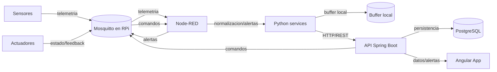
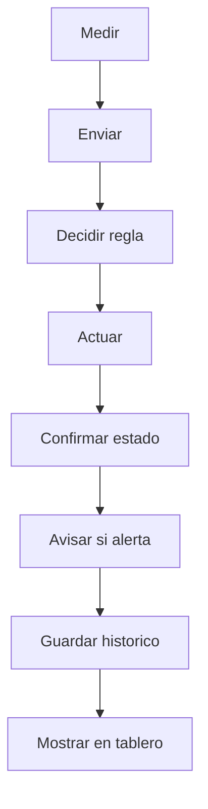
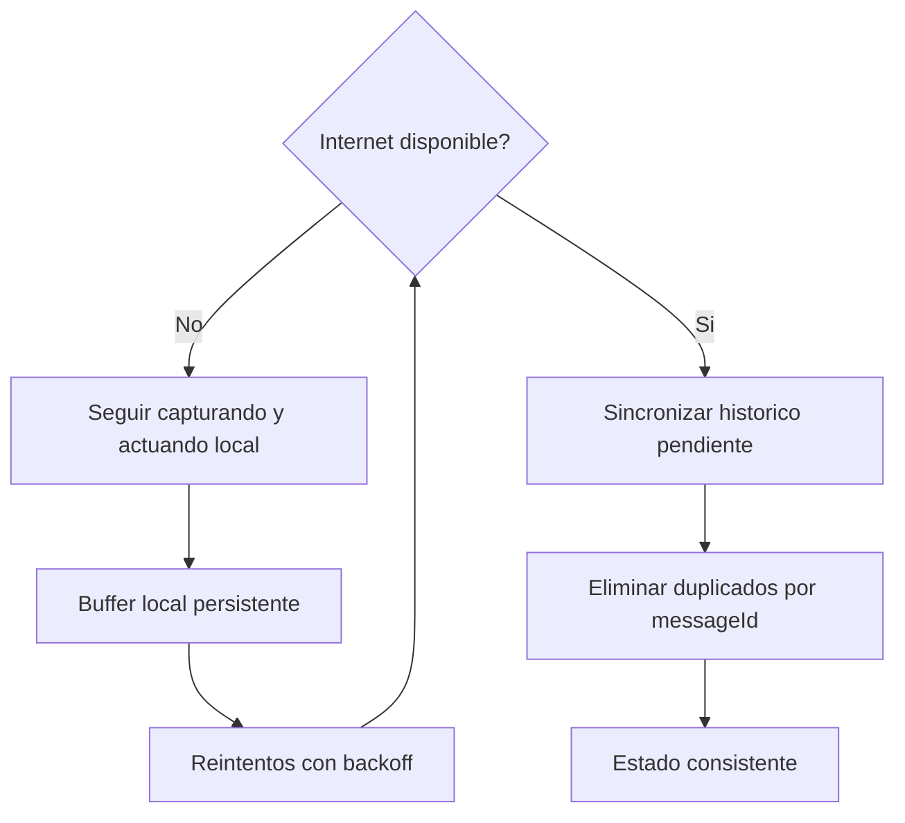

# agents.md

Documento operativo del repo (raiz del repo).

0. TL;DR (Arranque rapido)
1) Requisitos: Docker Desktop + Docker Compose v2, PowerShell.
2) Build plataforma: `docker compose -f infra/compose/docker-compose.platform.yml build`
3) Levantar todo: `docker compose -f infra/compose/docker-compose.edge.yml -f infra/compose/docker-compose.platform.yml up -d`
4) Mosquitto vivo: `docker compose -f infra/compose/docker-compose.edge.yml exec mosquitto mosquitto_sub -h localhost -t '$SYS/broker/uptime' -C 1 -v`
5) Node-RED accesible: `Invoke-WebRequest -Uri http://localhost:1880 -UseBasicParsing`
6) Backend responde: `Invoke-WebRequest -Uri http://localhost:8080/actuator/health -UseBasicParsing`
7) Backend ping: `Invoke-WebRequest -Uri http://localhost:8080/api/ping -UseBasicParsing`
8) Frontend carga: `Invoke-WebRequest -Uri http://localhost:4200 -UseBasicParsing`
9) Telemetria (ejemplo): `$ts=(Get-Date).ToString('o'); $msg="{`"deviceId`":`"temp-01`",`"ts`":`"$ts`",`"value`":23.4,`"unit`":`"C`",`"battery`":88,`"rssi`":-70,`"messageId`":`"m-0001`"}"; docker compose -f infra/compose/docker-compose.edge.yml exec mosquitto mosquitto_pub -h localhost -t agro/finca-01/zona-01/sensor/temperatura/telemetry -m "$msg"`
10) Alerta (ejemplo): `$ts=(Get-Date).ToString('o'); $msg="{`"deviceId`":`"temp-01`",`"ts`":`"$ts`",`"severity`":`"HIGH`",`"message`":`"umbral superado`",`"messageId`":`"a-0001`"}"; docker compose -f infra/compose/docker-compose.edge.yml exec mosquitto mosquitto_pub -h localhost -t agro/finca-01/zona-01/alerts -m "$msg"`
11) Actuador (ejemplo): `$ts=(Get-Date).ToString('o'); $msg="{`"deviceId`":`"valv-01`",`"ts`":`"$ts`",`"command`":`"OPEN`",`"messageId`":`"c-0001`"}"; docker compose -f infra/compose/docker-compose.edge.yml exec mosquitto mosquitto_pub -h localhost -t agro/finca-01/zona-01/actuator/valvula/cmd -m "$msg"`

1. Que es este proyecto
- Demo IoT agricola con MQTT y Raspberry Pi como gateway de borde.
- Edge: Mosquitto + Node-RED + servicios Python (contenedor base).
- Backend: Spring Boot minimo con `/api/ping` y `/actuator/health`.
- Frontend: Angular en modo DEV (`ng serve`).
- La multi-ubicacion se modela como convencion de topicos (finca/zona) en MQTT.
- Requisitos del PDF: monitoreo casi real, alertas, control de actuadores con feedback, configuracion por usuario, historicos, offline, seguridad por roles y auditoria (pendiente de implementar en backend/flows).

2. Arquitectura

2.1 Diagrama de arquitectura (Mermaid)


2.2 Flujo funcional normal (Mermaid)


2.3 Offline y resiliencia (Mermaid + explicacion)

Requisito del PDF: idempotencia por `messageId` + `deviceId` para evitar duplicados al reconectar (pendiente de implementar).

3. Mapa del repo (tabla)
| Ruta | Que contiene | Proposito | Como se ejecuta | Persistencia | Notas |
| --- | --- | --- | --- | --- | --- |
| `backend/` | Spring Boot minimo | API | `docker compose -f infra/compose/docker-compose.platform.yml up -d backend` | N/A | Implementa `/api/ping` y `/actuator/health` |
| `backend/Dockerfile` | Build multi-stage | Imagen backend | `docker compose -f infra/compose/docker-compose.platform.yml build backend` | N/A | Java 21 |
| `frontend/` | Angular DEV | UI | `docker compose -f infra/compose/docker-compose.platform.yml up -d frontend` | N/A | `ng serve` |
| `frontend/Dockerfile` | Node + ng serve | Imagen frontend | `docker compose -f infra/compose/docker-compose.platform.yml build frontend` | N/A | CHOKIDAR polling |
| `edge/mosquitto/config/mosquitto.conf` | Config broker | MQTT broker | `docker compose -f infra/compose/docker-compose.edge.yml up -d mosquitto` | `edge/mosquitto/data`, `edge/mosquitto/log` | allow_anonymous true |
| `edge/mosquitto/data/` | Datos Mosquitto | Persistencia | via volumen | carpeta local | vacio |
| `edge/mosquitto/log/` | Logs Mosquitto | Logs | via volumen | carpeta local | vacio |
| `edge/nodered/data/` | Datos Node-RED | Flows/credenciales | via volumen | carpeta local | vacio |
| `edge/python/services/` | Servicios Python | Drivers/simuladores | via volumen | carpeta local | vacio |
| `infra/compose/docker-compose.edge.yml` | Edge compose | Mosquitto + Node-RED + Python | `docker compose -f ... up -d` | volumenes locales | nodered image tag 3.1 |
| `infra/compose/docker-compose.platform.yml` | Platform compose | Postgres + backend + frontend | `docker compose -f ... up -d` | `pgdata` | backend healthcheck |
| `docs/diagrams/` | Diagramas | Documentacion | N/A | N/A | vacio |
| `docs/runbook/` | Runbook | Procedimientos | N/A | N/A | vacio |
| `docs/requirements/` | PDF requisitos | Fuente oficial | N/A | N/A | carpeta escrita como "requierments" |

4. Stack y servicios (tabla de puertos)
| Servicio | Puerto(s) | URL local | Healthcheck / como comprobarlo | Donde se configura |
| --- | --- | --- | --- | --- |
| Mosquitto | 1883, 8883 | `mqtt://localhost:1883` | `docker compose -f infra/compose/docker-compose.edge.yml exec mosquitto mosquitto_sub -h localhost -t '$SYS/broker/uptime' -C 1 -v` | `edge/mosquitto/config/mosquitto.conf` |
| Node-RED | 1880 | `http://localhost:1880` | `Invoke-WebRequest http://localhost:1880` | `infra/compose/docker-compose.edge.yml` |
| Backend | 8080 | `http://localhost:8080` | `Invoke-WebRequest http://localhost:8080/actuator/health` | `infra/compose/docker-compose.platform.yml` |
| Frontend | 4200 | `http://localhost:4200` | `Invoke-WebRequest http://localhost:4200` | `infra/compose/docker-compose.platform.yml` |
| PostgreSQL | Host 3608 -> Contenedor 5432 | `postgres://localhost:3608` | `docker compose -f infra/compose/docker-compose.platform.yml exec postgres pg_isready -U glea -d glea_nexo` | `infra/compose/docker-compose.platform.yml` |

5. Convenciones MQTT (topicos + QoS + retain)
Convencion alineada con el PDF:
- `agro/{fincaId}/{zonaId}/sensor/{tipo}/telemetry`
- `agro/{fincaId}/{zonaId}/sensor/{tipo}/status`
- `agro/{fincaId}/{zonaId}/actuator/{tipo}/cmd`
- `agro/{fincaId}/{zonaId}/actuator/{tipo}/state`
- `agro/{fincaId}/{zonaId}/alerts`

Payload base (ejemplo):
```json
{
  "deviceId": "temp-01",
  "ts": "2026-02-01T12:00:00Z",
  "value": 23.4,
  "unit": "C",
  "battery": 88,
  "rssi": -70,
  "messageId": "m-0001"
}
```

QoS/retain/LWT recomendados por resiliencia:
- Telemetria: QoS 1, retain = false.
- Status de sensor: QoS 1, retain = true.
- Cmd actuador: QoS 1 o 2, retain = false.
- State actuador: QoS 1, retain = true.
- Alerts: QoS 1, retain = false.
- LWT: `.../status` con payload `{"state":"offline","ts":...}`.

6. Docker & Compose (como levantar el sistema)

6.1 Donde estan los compose
- `infra/compose/docker-compose.edge.yml`
- `infra/compose/docker-compose.platform.yml`

6.2 Comandos PowerShell
- Build: `docker compose -f infra/compose/docker-compose.platform.yml build`
- Levantar edge+platform: `docker compose -f infra/compose/docker-compose.edge.yml -f infra/compose/docker-compose.platform.yml up -d`
- Estado: `docker compose -f infra/compose/docker-compose.edge.yml -f infra/compose/docker-compose.platform.yml ps`
- Logs: `docker compose -f infra/compose/docker-compose.platform.yml logs -f backend`
- Entrar a contenedor: `docker compose -f infra/compose/docker-compose.platform.yml exec backend sh` (contenedor Linux; usar `sh`, no PowerShell/cmd)
- Volumenes: `docker volume ls`

6.3 Persistencia
- `edge/mosquitto/data`, `edge/mosquitto/log`
- `edge/nodered/data`
- `pgdata` (volumen Docker)

6.4 Hot reload (frontend)
- Se monta `../../frontend:/app` y se habilita `CHOKIDAR_USEPOLLING=true`. En Windows puede ser mas lento.

7. Runbook de validacion end-to-end
1) Verificar broker: `docker compose -f infra/compose/docker-compose.edge.yml exec mosquitto mosquitto_sub -h localhost -t '$SYS/broker/uptime' -C 1 -v`.
2) Backend health: `Invoke-WebRequest http://localhost:8080/actuator/health`.
3) Backend ping: `Invoke-WebRequest http://localhost:8080/api/ping`.
4) Dashboard Angular: `Invoke-WebRequest http://localhost:4200`.
5) Publicar telemetria (ver TL;DR paso 9).
6) Verificacion de publicacion (MQTT): `powershell -NoProfile -Command '& { $root = (Get-Location).Path; $job = Start-Job -ArgumentList $root -ScriptBlock { param($path) Set-Location $path; docker compose -f infra/compose/docker-compose.edge.yml exec mosquitto mosquitto_sub -h localhost -t agro/# -C 1 -v }; Start-Sleep -Seconds 1; $ts=(Get-Date).ToString("o"); $payload = [ordered]@{deviceId="temp-01"; ts=$ts; value=23.4; unit="C"; battery=88; rssi=-70; messageId="m-0001"} | ConvertTo-Json -Compress; docker compose -f infra/compose/docker-compose.edge.yml exec mosquitto mosquitto_pub -h localhost -t agro/finca-01/zona-01/sensor/temperatura/telemetry -m $payload; Receive-Job $job -Wait -AutoRemoveJob }'`.
7) Alertas: publicar a `agro/.../alerts` (ver TL;DR paso 10).
8) Comando actuador: publicar a `agro/.../actuator/.../cmd` (ver TL;DR paso 11).
9) Persistencia e historicos: pendiente de implementar en backend.

8. Node-RED (flows y responsabilidades)
Actual: no hay flows en `edge/nodered/data`.
Responsabilidades requeridas por el PDF:
- Ingestion MQTT, validacion y normalizacion.
- Reglas por umbral/horario y generacion de alertas.
- Control de actuadores con feedback.
- Buffer offline y reintentos hacia backend.
- Envio HTTP hacia backend.

9. Python services (edge/python/services)
Actual: carpeta vacia.
Estructura esperada:
- Un servicio por sensor/driver o familia.
- Un simulador.
- Health-check basico y logging JSON.
- Config por env: `DEVICE_ID`, `FINCA_ID`, `ZONA_ID`, `MQTT_HOST`, `MQTT_PORT`.
- Publicacion MQTT con `messageId` y `ts` ISO-8601.

10. Backend (Spring Boot)
Actual:
- `/api/ping`
- `/actuator/health`
- JDBC configurado para `postgres:5432` dentro de la red Docker.
Pendiente por requisito del PDF:
- Ingesta de lecturas.
- Consulta de historicos.
- Gestion de dispositivos, alertas y comandos.
- Seguridad JWT + roles (`ADMIN`, `OPERATOR`, `VIEWER`).
- Audit log (quien hizo que y cuando).

11. Frontend (Angular responsivo)
Actual: app Angular minima (DEV).
Pendiente:
- Login.
- Overview finca/zona.
- Detalle sensor (live + historico).
- Alertas.
- Control de actuador.
- Configuracion basica.

12. Seguridad, datos y operacion
Estado actual:
- Mosquitto permite anonimo en `edge/mosquitto/config/mosquitto.conf`.
Pendiente por requisito del PDF:
- MQTT auth + ACL.
- TLS/HTTPS.
- JWT + roles en backend.
- Auditoria de acciones.
- Backup de Postgres.
- Watchdog/restart policies y reconexion con QoS.

13. Troubleshooting
- Backend reinicia: `docker compose -f infra/compose/docker-compose.platform.yml logs -f backend`.
- No llega telemetria: revisar topico y `edge/mosquitto/config/mosquitto.conf`.
- Node-RED no carga: `Invoke-WebRequest http://localhost:1880` y logs `docker compose -f infra/compose/docker-compose.edge.yml logs -f nodered`.
- Frontend no responde: `Invoke-WebRequest http://localhost:4200` y logs `docker compose -f infra/compose/docker-compose.platform.yml logs -f frontend`.
- Postgres no conecta: revisar host port publicado (actual 3608) y `pg_isready`.

14. Roadmap demo -> piloto
- Offline robusto + replay con deduplicacion.
- TLS MQTT + gestion de certificados.
- Device provisioning.
- OTA / gestion remota del gateway.
- Observabilidad (metrics, logs, tracing).
