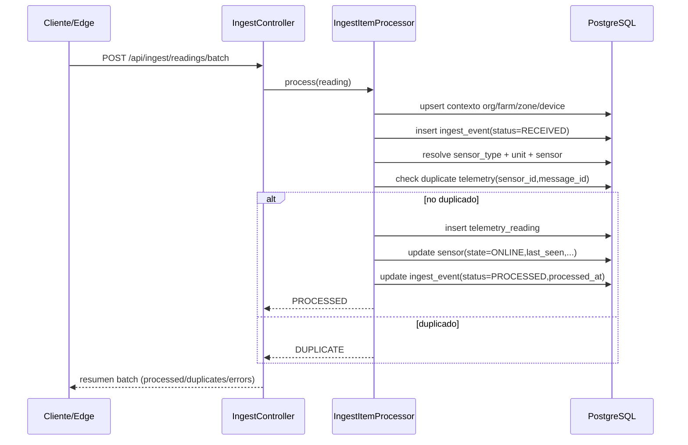

# ITER-002 - Persistencia Completa Telemetría

**Fecha:** 15/02/2026  
**Autor:** Glea Nexo Team  
**Estado:** ⚠️ En Progreso (implementación completa en código + tests; redeploy pendiente en entorno Docker activo)

***

## 1. OBJETIVO

En ITER-002 se implementó la persistencia útil de lecturas de telemetría en `TelemetryReading`, manteniendo la auditoría de ingesta en `IngestEvent` y agregando la actualización del estado del sensor (`ONLINE`, `lastSeenAt`, batería y RSSI).

ITER-001 resolvía deduplicación y trazabilidad de eventos de ingesta, pero no dejaba datos listos para analítica o histórico. Este gap impedía habilitar dashboards, alertas y consultas por ventana temporal.

Con ITER-002, cada lectura válida puede convertirse en dato operacional persistido, habilitando base para gráficas, alertas y consultas históricas. Además, se refuerza la consistencia con deduplicación a nivel de telemetría por `(sensor_id, message_id)`.

***

## 2. CAMBIOS IMPLEMENTADOS

### 2.1 Nuevos Repositorios

```java
// SensorRepository.java
@Repository
public interface SensorRepository extends JpaRepository<Sensor, UUID> {
    Optional<Sensor> findByOrganization_IdAndSensorUid(UUID organizationId, String sensorUid);
    boolean existsByOrganization_IdAndSensorUid(UUID organizationId, String sensorUid);
}
```

```java
// SensorTypeRepository.java
@Repository
public interface SensorTypeRepository extends JpaRepository<SensorType, Long> {
    Optional<SensorType> findByCode(String code);
}
```

```java
// UnitRepository.java
@Repository
public interface UnitRepository extends JpaRepository<Unit, Long> {
    Optional<Unit> findByCode(String code);
}
```

```java
// TelemetryReadingRepository.java
public interface TelemetryReadingRepository extends JpaRepository<TelemetryReading, UUID> {
    boolean existsBySensor_IdAndMessageId(UUID sensorId, String messageId);
}
```

Nota: `TelemetryReadingRepository` funciona por escaneo Spring Data, pero queda pendiente alinear con criterio interno de anotar explícitamente `@Repository`.

### 2.2 Modificaciones IngestItemProcessor

Implementación verificada en `backend/src/main/java/com/glea/nexo/application/ingest/IngestItemProcessor.java`.

```java
@Transactional(propagation = Propagation.REQUIRES_NEW)
public IngestItemResult process(IngestBatchRequestDto request, IngestReadingDto reading, int index) {
    // 1) Contexto org/farm/zone/device
    // 2) Persistencia ingest_event

    String sensorTypeCode = extractSensorTypeFromTopic(topicParts);
    SensorType sensorType = resolveSensorType(sensorTypeCode);

    Unit unit = null;
    if (reading.unit() != null && !reading.unit().isBlank()) {
        unit = resolveUnit(reading.unit());
    }

    Sensor sensor = resolveSensor(organization, farm, zone, device, sensorType, unit, deviceUid);

    if (telemetryReadingRepository.existsBySensor_IdAndMessageId(sensor.getId(), reading.messageId())) {
        return IngestItemResult.duplicate(index, reading.messageId(), "duplicate telemetry reading by exists check");
    }

    TelemetryReading telemetry = new TelemetryReading();
    telemetry.setIngestEvent(ingestEvent);
    telemetry.setOrganization(organization);
    telemetry.setFarm(farm);
    telemetry.setZone(zone);
    telemetry.setDevice(device);
    telemetry.setSensor(sensor);
    telemetry.setUnit(unit);
    telemetry.setMessageId(reading.messageId());
    telemetry.setTs(reading.ts() != null ? reading.ts() : Instant.now());
    telemetry.setValueNum(reading.value());
    telemetry.setBatteryV(reading.battery());
    telemetry.setRssi(reading.rssi());
    telemetry.setQuality(QualityLevel.UNKNOWN);
    telemetry.setRawPayload(ingestEvent.getRawPayload());

    telemetry = telemetryReadingRepository.saveAndFlush(telemetry);

    sensor.setLastSeenAt(telemetry.getTs());
    sensor.setLastBatteryV(telemetry.getBatteryV());
    sensor.setLastRssi(telemetry.getRssi());
    sensor.setState(OnlineState.ONLINE);
    sensorRepository.save(sensor);

    ingestEvent.setStatus(IngestStatus.PROCESSED);
    ingestEvent.setProcessedAt(Instant.now());
    ingestEventRepository.save(ingestEvent);

    return IngestItemResult.processed(index, reading.messageId(), "telemetry reading persisted");
}
```

### 2.3 Nuevas Entidades/Actualizaciones

- `TelemetryReading`: relaciones con organización/finca/zona/device/sensor/unit, payload crudo JSONB, `quality`, `messageId`, `ingestEvent`.
- `Sensor`: estado online y telemetría desnormalizada (`lastSeenAt`, `lastBatteryV`, `lastRssi`).
- `IngestEvent`: `status`, `processedAt`, `errorCode`, `errorMessage`.

### 2.4 Base de Datos

SQL de catálogo en `backend/src/main/resources/db/migration/V001__seed_sensor_catalog.sql`:

```sql
INSERT INTO sensor_type (id, code, name, description) VALUES
(1, 'TEMPERATURE', ...), ... (8, 'GPS', ...)
ON CONFLICT (code) DO NOTHING;

INSERT INTO unit (id, code, symbol, name) VALUES
(1, 'CELSIUS', '°C', ...), ... (9, 'VOLTS', 'V', ...)
ON CONFLICT (code) DO NOTHING;
```

***

## 3. DECISIONES DE DISEÑO

### 3.1 Simplificación MVP: sensorUid = deviceId

**Decisión:** En ITER-002, un device = un sensor lógico.  
**Razón:** DTO actual no distingue `deviceId` y `sensorId`.  
**Impacto:** Suficiente para MVP funcional de ingesta + histórico básico.  
**Trade-off:** Menor flexibilidad para gateways multisensor.  
**Evolución:** separar `sensorId` explícito en ITER-004.

### 3.2 Validación estricta SensorType

**Decisión:** Resolver tipo desde catálogo y fallar si no existe.  
**Razón:** Evitar deriva semántica de tipos (`temp`, `temperatura`, etc.).  
**Impacto:** consistencia para analítica/reportes.  
**Trade-off:** menor flexibilidad ad-hoc.  
**Evolución:** API admin para alta de tipos.

### 3.3 Quality por defecto `UNKNOWN`

**Decisión:** si DTO no informa calidad, persistir `QualityLevel.UNKNOWN`.  
**Razón:** contrato actual no trae `quality`.  
**Evolución:** cálculo dinámico por señal/batería en ITER-003.

***

## 4. ARQUITECTURA DEL FLUJO



***

## 5. TESTS IMPLEMENTADOS

### 5.1 Test: Persistencia Telemetría

**Archivo:** `backend/src/test/java/com/glea/nexo/api/controller/IngestControllerIntegrationTest.java`  
**Método:** `shouldPersistTelemetryReadingAndUpdateSensor()`

**Escenario:** POST con lectura válida de temperatura.

**Verificaciones:**
- Se inserta `TelemetryReading` con `value=23.4`, `battery=3.85`, `rssi=-68`, `quality=UNKNOWN`.
- `Sensor.state = ONLINE`, `lastSeenAt != null`.
- `IngestEvent.status = PROCESSED`, `processedAt != null`.

### 5.2 Test: Detección Duplicados

**Archivo:** `backend/src/test/java/com/glea/nexo/api/controller/IngestControllerIntegrationTest.java`  
**Método:** `shouldDetectDuplicateTelemetry()`

**Escenario:** mismo `messageId` enviado dos veces.

**Verificaciones:**
- Primera llamada: `processed=1`.
- Segunda llamada: `duplicates=1`.
- Existe solo 1 `TelemetryReading` para ese `messageId`.

***

## 6. VERIFICACIÓN E2E

### Script de Validación

```powershell
$base = 'http://localhost:8080/api/ingest/readings/batch'
$messageId = "test-unique-$([guid]::NewGuid())"

$payload = @{
  source = 'validation'
  topic = 'agro/finca-demo/zona-a/sensor/temperature/telemetry'
  readings = @(@{
    messageId = $messageId
    deviceId = 'temp-01'
    ts = '2026-02-15T11:00:00Z'
    value = 23.4
    unit = 'C'
    battery = 3.85
    rssi = -68
  })
} | ConvertTo-Json -Depth 5

$r1 = Invoke-RestMethod -Method Post -Uri $base -ContentType 'application/json' -Body $payload
$r2 = Invoke-RestMethod -Method Post -Uri $base -ContentType 'application/json' -Body $payload

$r1
$r2

docker compose -f infra/compose/docker-compose.platform.yml exec -T postgres psql -U glea -d glea_nexo -c "SELECT message_id, value_num, ts FROM telemetry_reading WHERE message_id='$messageId';"
docker compose -f infra/compose/docker-compose.platform.yml exec -T postgres psql -U glea -d glea_nexo -c "SELECT sensor_uid, state, last_seen_at FROM sensor WHERE sensor_uid='temp-01';"
docker compose -f infra/compose/docker-compose.platform.yml exec -T postgres psql -U glea -d glea_nexo -c "SELECT message_id, status, processed_at FROM ingest_event WHERE message_id='$messageId';"
```

### Salida Esperada

- Primera llamada: `processed=1`
- Segunda llamada: `duplicates=1`
- `telemetry_reading`: 1 fila para ese `messageId`
- `sensor.state = ONLINE`
- `ingest_event.status = PROCESSED`

### Estado observado en entorno actual

- API responde 200 y dedupe a nivel ingest.
- El backend docker en ejecución está desalineado con ITER-002 (solo persiste `ingest_event`), por lo que no se observó inserción de `telemetry_reading` en ese runtime.

***

## 7. MÉTRICAS DE IMPLEMENTACIÓN

| Métrica | Valor |
|---------|-------|
| Archivos backend impactados (ITER-002) | 10+ (repos, entidades, processor, test, migration) |
| Tests integración ITER-002 | 3 |
| Tests integración exitosos | 3/3 |
| Tiempo validación técnica en esta revisión | ~1.5 horas |
| Cobertura tests | N/D (JaCoCo no configurado) |

***

## 8. DoD (Definition of Done)

- [x] Código compila sin errores
- [x] Tests integración pasan (3/3)
- [ ] Script validación E2E exitoso en backend docker activo
- [x] `TelemetryReading` persiste en tests integración
- [x] `Sensor.state` actualiza a `ONLINE` en tests integración
- [x] `IngestEvent.status = PROCESSED` en tests integración
- [x] Deduplicación funciona
- [x] Documentación actualizada
- [ ] Code review final de merge

***

## 9. DEUDA TÉCNICA IDENTIFICADA

- Ajustar healthcheck backend en compose a puerto interno 8081.
- Alinear imagen docker backend con código ITER-002 antes de aceptación E2E.
- Añadir `@Repository` explícito en `TelemetryReadingRepository` para cumplir estándar interno.
- Definir y versionar script E2E (`backend/scripts/validate-iter-002.ps1`).
- Evaluar transición de `ddl-auto=update` a migraciones controladas para producción.

***

## 10. PRÓXIMOS PASOS (ITER-003)

1. API de consulta histórica (`GET /api/telemetry`).
2. Dashboard Angular con series temporales.
3. Motor de alertas por umbral.
4. Eventos async para desacoplar updates de sensor.
5. Cálculo dinámico de `quality`.

***

## 11. QUERIES SQL ÚTILES

```sql
-- Últimas 10 lecturas por zona
SELECT zone_id, sensor_id, ts, value_num, unit_id
FROM telemetry_reading
ORDER BY ts DESC
LIMIT 10;

-- Sensores potencialmente offline (>15 min sin reporte)
SELECT sensor_uid, state, last_seen_at
FROM sensor
WHERE last_seen_at IS NULL OR last_seen_at < now() - interval '15 minutes'
ORDER BY last_seen_at NULLS FIRST;

-- Tasa de ingesta últimos 60 minutos
SELECT date_trunc('minute', created_at) AS minute_bucket, count(*) AS events
FROM ingest_event
WHERE created_at >= now() - interval '60 minutes'
GROUP BY 1
ORDER BY 1;
```

***

## 12. TROUBLESHOOTING

### Problema: "Sensor type not found"

**Síntoma:** error de validación al procesar lectura con tipo no catalogado.  
**Causa:** `resolveSensorType()` aplica validación estricta por código.  
**Solución:** usar tipos válidos (`TEMPERATURE`, `SOIL_MOISTURE`, `HUMIDITY`, `PH`, `EC`, `LIGHT`, `PRESSURE`, `GPS`) o ampliar catálogo de forma controlada.

### Problema: Lecturas no aparecen en BD

**Diagnóstico:**

```powershell
docker compose -f infra/compose/docker-compose.platform.yml logs --tail=200 backend
docker compose -f infra/compose/docker-compose.platform.yml exec -T postgres psql -U glea -d glea_nexo -c "SELECT count(*) FROM telemetry_reading;"
```

Si solo aparece `ingest duplicate pre-check` y no `Telemetry persisted`, reconstruir backend y relanzar servicio.

***

## APÉNDICES

### A. Estructura Catálogo `sensor_type`

| code | nombre |
|---|---|
| TEMPERATURE | Temperatura |
| SOIL_MOISTURE | Humedad Suelo |
| HUMIDITY | Humedad Ambiente |
| PH | pH Suelo |
| EC | Conductividad Eléctrica |
| LIGHT | Luz |
| PRESSURE | Presión Atmosférica |
| GPS | Posicionamiento |

### B. Estructura Catálogo `unit`

| code | símbolo |
|---|---|
| CELSIUS | °C |
| FAHRENHEIT | °F |
| PERCENT | % |
| PH_SCALE | pH |
| MS_CM | mS/cm |
| LUX | lx |
| HPA | hPa |
| DBM | dBm |
| VOLTS | V |

### C. Constraints y Foreign Keys

- `telemetry_reading`: UNIQUE `uk_reading_sensor_message (sensor_id, message_id)`.
- Índices: `idx_tr_sensor_ts`, `idx_tr_zone_ts`, `idx_tr_device_ts`.
- FK principales: `organization_id`, `farm_id`, `zone_id`, `device_id`, `sensor_id`, `unit_id`, `ingest_event_id`.

***

**Documento Vivo:** actualizar tras cada cambio funcional relevante en ingesta.  
**Última Revisión:** 15/02/2026
