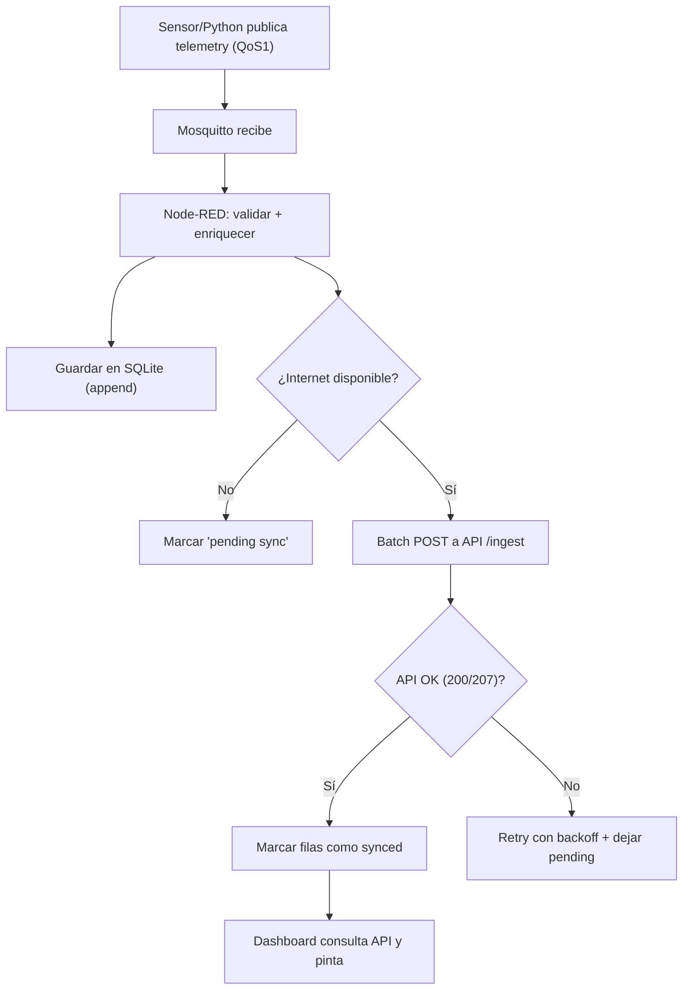
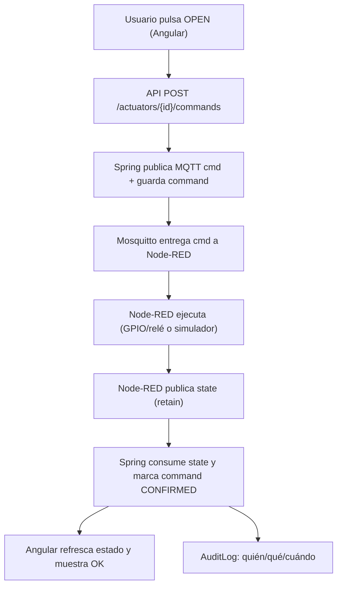
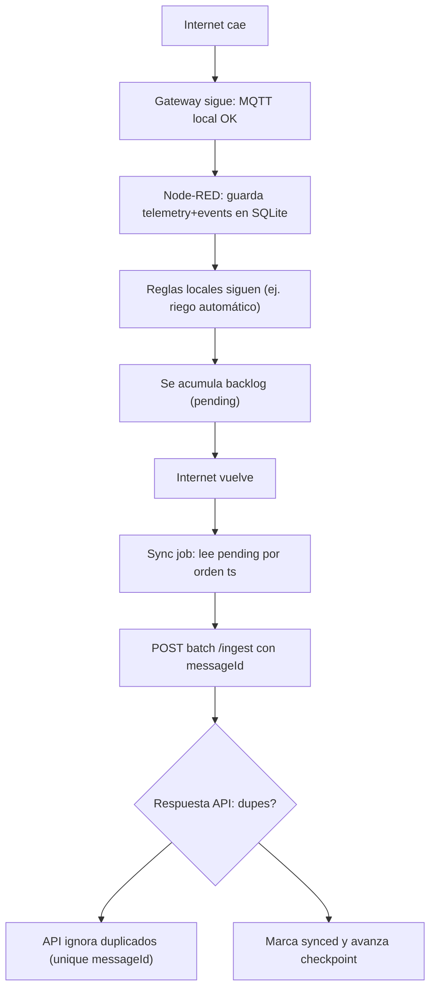
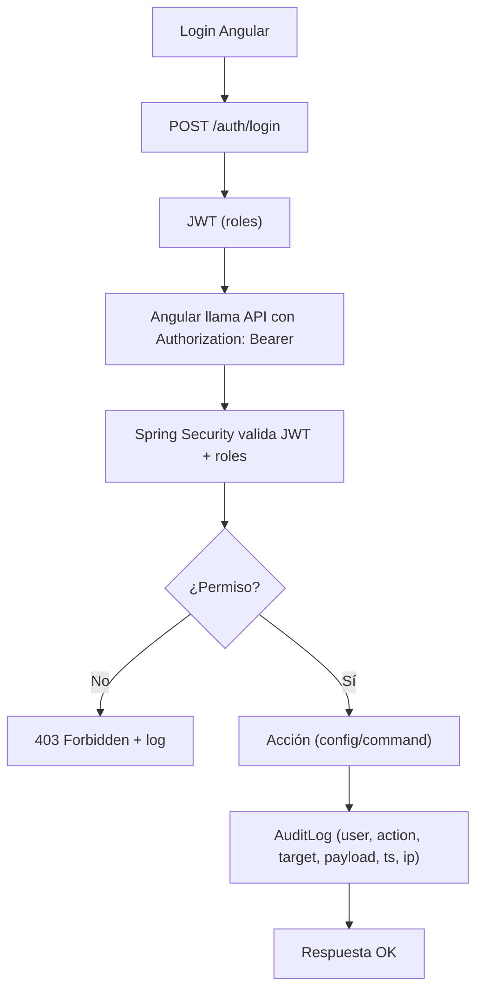
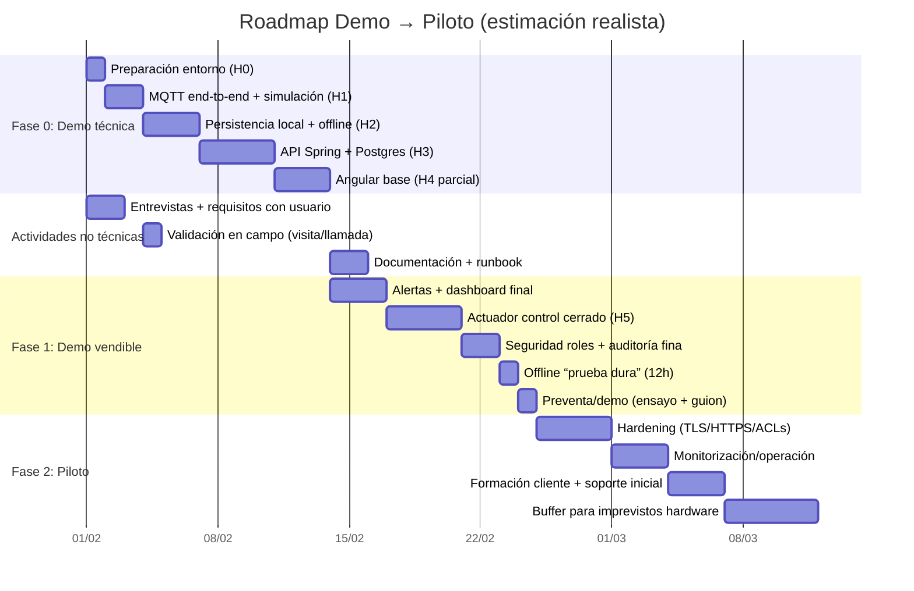

# Guía de ejecución realista: Demo vendible → Piloto IoT agrícola (Edge Raspberry + MQTT + Node-RED + Python + Spring Boot + Angular)

> **Supuestos por defecto (si no dices lo contrario):** 10 sensores, 1 actuador (válvula/relé), 1 finca, 2 zonas, telemetría cada 60s, offline 2–12h, retención 12 meses (demo), 3–5 años (piloto), equipo: 1 dev + 1 usuario validando.

---

## A) Resumen ejecutivo

### Qué se va a construir (demo vendible) y qué valor demuestra

Vas a montar una **plataforma IoT agrícola “de verdad”** que funciona en entornos rurales con conectividad irregular:

* **Edge/Gateway (Raspberry Pi):** recibe telemetría vía MQTT, aplica reglas locales (Node-RED), ejecuta drivers/validación (Python), guarda buffer offline (SQLite) y sincroniza a backend cuando vuelve Internet.
* **Backend (Spring Boot + PostgreSQL):** API REST segura (JWT + roles), ingesta idempotente de telemetría, histórico consultable, alertas/eventos y auditoría.
* **Frontend (Angular):** dashboard responsive móvil con “live”, históricos, alertas, control de actuador con confirmación, y configuración por usuario (umbrales/horarios).

Esto **demuestra valor** típico en agricultura: monitorización casi en tiempo real, alertas, control de actuadores, configuración sin tocar código, histórico y operación en offline. Estos requisitos aparecen una y otra vez en proyectos reales de IoT agrícola con Raspberry + MQTT (monitorización, alertas, actuadores, configuración, histórico, multi-ubicación, offline y seguridad). 

### Qué NO se construye en V1 (para mantenerlo realista)

Para una demo vendible **no metas “enterprise” antes de tiempo**:

* No hay multi-tenant complejo (varios clientes aislados con billing).
* No hay gestión OTA completa de firmware de sensores.
* No hay IA/ML ni predicción avanzada (solo reglas y tendencias simples).
* No hay alta disponibilidad multi-nodo (ni clustering MQTT/DB).
* No hay app nativa: es **SPA responsive** (PWA opcional solo si aporta).

### Resultados esperados (qué puede enseñar un cliente en 10 minutos)

En 10 minutos el cliente ve:

1. **Live**: telemetría entrando cada 60s (o más rápido) y pintada en el dashboard.
2. **Histórico**: filtros por finca/zona/sensor y gráfica por rango.
3. **Alerta real**: umbral o tendencia simple (ej. humedad baja sostenida) + registro del evento.
4. **Actuador**: botón “Abrir válvula” → confirmación de estado (control cerrado).
5. **Offline**: desconectas Internet del gateway, sigue midiendo/actuando, y al volver sincroniza sin duplicar.
6. **Seguridad**: login, roles (admin/técnico/operario/solo lectura), y auditoría (quién cambió qué y cuándo).

---

## B) Requisitos

> Nota: agrupo Must/Should/Could/Won’t (MoSCoW) y a cada requisito le añado **criterio de aceptación** (“cómo se valida”).

### B1) Funcionales (Must/Should/Could/Won’t)

#### Must (imprescindible para demo vendible)

1. **Telemetría casi en tiempo real**

* **Descripción:** recibir lecturas de sensores (humedad suelo, temp, etc.) cada 60s y mostrarlas en UI “live”.
* **Aceptación:** con 10 sensores a 60s, el dashboard muestra el último valor con retraso < 5–10s en LAN; en WAN depende de red, pero debe verse actualizado “al minuto”.

2. **Alertas (umbral + tendencia simple)**

* **Descripción:** reglas tipo “humedad < X durante N minutos” o “temp > X” y generar evento/alerta.
* **Aceptación:** forzando valores fuera de rango, se crea alerta en backend y aparece en UI; queda registrada con timestamp.

3. **Control de actuadores con confirmación de estado (control cerrado)**

* **Descripción:** comando desde UI → backend → MQTT → gateway → actuador; retorno de estado (abierto/cerrado + timestamp).
* **Aceptación:** cada comando recibe “ACK” (confirmación) y estado final en < 5–15s; si no llega, la UI muestra fallo/timeout.

4. **Históricos y filtros**

* **Descripción:** consultas por finca/zona/sensor/fecha; gráficas.
* **Aceptación:** se puede pedir “últimas 24h” y ver serie; export CSV opcional (Should).

5. **Multi-dispositivo / multi-zona / multi-finca (básico)**

* **Descripción:** modelo jerárquico: finca → zona → dispositivos/sensores.
* **Aceptación:** al menos 1 finca y 2 zonas separadas; UI permite filtrar por zona.

6. **Configuración por usuario**

* **Descripción:** umbrales, horarios y parámetros sin redeploy.
* **Aceptación:** cambio umbral en UI → se aplica en reglas (local o backend) en < 1 min y queda auditado.

7. **Modo offline en gateway + sincronización posterior**

* **Descripción:** si cae Internet, el gateway sigue: captura telemetría, ejecuta reglas y guarda buffer; al volver, sincroniza.
* **Aceptación:** cortar Internet 2–12h; se siguen acumulando lecturas; al reconectar, el backend recibe todo sin huecos ni duplicados.

8. **Seguridad y roles (admin/técnico/operario/solo lectura)**

* **Descripción:** permisos por endpoint y por acción (configurar, accionar).
* **Aceptación:** un “solo lectura” no puede enviar comandos ni editar umbrales; un “operario” puede accionar pero no cambiar reglas globales.

9. **Auditoría de acciones**

* **Descripción:** registrar cambios de configuración y comandos de actuador: quién, qué, cuándo, desde dónde.
* **Aceptación:** cada comando y cambio crítico genera `AuditLog` consultable por admin.

> Estos puntos (monitorización, alertas, actuadores, configuración, histórico, multi-ubicación, offline, seguridad y trazabilidad) son exactamente lo que se repite como “común” en soluciones IoT agrícolas reales. 

#### Should (muy recomendable)

10. **Notificación básica**

* **Descripción:** notificación por email o webhook (sin montar un sistema enorme).
* **Aceptación:** alerta crítica dispara una notificación al menos por canal único (email o webhook).

11. **Panel de “salud”**

* **Descripción:** mostrar sensores caídos (LWT), batería baja, calidad.
* **Aceptación:** si un sensor deja de publicar, se marca “offline” en UI.

12. **Export CSV**

* **Aceptación:** descarga de lecturas filtradas por rango.

#### Could (si hay tiempo)

13. **PWA (modo “instalable”)**

* **Aceptación:** se puede “instalar” en móvil y abrir en pantalla completa; cache de assets básico.

14. **Programación de riego con calendario simple**

* **Aceptación:** horario diario y excepción manual.

#### Won’t (no en V1)

* Multi-tenant completo, OTA, ML, clustering HA.

---

### B2) No funcionales (resiliencia, seguridad, operación)

1. **Resiliencia MQTT (QoS, retain, Last Will)**

* **Descripción:** QoS según criticidad, estados con retain, LWT para caídas.
* **Aceptación:** desconectar un cliente: se publica LWT y el sistema lo refleja.

2. **Reintentos y reconexión**

* **Descripción:** Node-RED y Python reconectan a MQTT y a API con backoff.
* **Aceptación:** reiniciar Mosquitto o cortar red: los servicios recuperan sin intervención manual.

3. **Buffer local + replay**

* **Descripción:** almacenar lecturas en SQLite local (WAL) y re-enviar por lotes.
* **Aceptación:** cortar Internet, acumular 2–12h; reenganchar: se sincroniza completo.

4. **Evitar duplicados (idempotencia end-to-end)**

* **Descripción:** cada mensaje tiene `messageId` único; backend lo hace único en BD.
* **Aceptación:** re-enviar el mismo lote: el backend no duplica filas (mismo `messageId`).

5. **Rendimiento mínimo**

* **Objetivo:** 10 sensores cada 60s (≈ 10 msg/min) + estados/alertas.
* **Aceptación:** sin pérdidas, CPU/RAM estable en Raspberry Pi, latencias razonables.

6. **Seguridad**

* **MQTT:** credenciales + ACLs; TLS “si procede” (piloto).
* **API:** HTTPS (al menos en piloto), JWT, secretos fuera del código.
* **Aceptación:** sin credenciales no se puede publicar/suscribir; endpoints protegidos.

7. **Mantenibilidad**

* **Descripción:** docker-compose reproducible, `.env`, scripts y documentación.
* **Aceptación:** en una Raspberry “limpia” lo levantas siguiendo el runbook en < 1–2h.

8. **Observabilidad mínima**

* **Descripción:** logs centralizados por `docker logs`, healthchecks, métricas básicas (Spring Actuator).
* **Aceptación:** un comando te dice “qué está caído” y por qué.

---

## C) Casos de uso (para vender)

### Caso 1 — Riego de precisión (humedad → decisión local → válvula → registro → dashboard)

* **Actores:** Operario (ejecuta), Técnico (ajusta umbrales), Admin (audita).
* **Inputs:** humedad suelo (%VWC), estado válvula, caudal (opcional).
* **Outputs:** comando ON/OFF, estado confirmado, evento/auditoría.
* **Métrica de valor:** ahorro de agua (%) + evitar estrés hídrico.
* **Demo “wow”:** bajas la humedad simulada, el gateway decide abrir válvula, se confirma estado y queda trazado + gráfico.

### Caso 2 — Microclima (temp/humedad → alerta → recomendación/acción)

* **Actores:** Técnico, Solo lectura (consulta).
* **Inputs:** temperatura, humedad aire.
* **Outputs:** alerta “golpe de calor”, recomendación o activación (si hubiera actuador).
* **Métrica:** reducción de riesgo (horas fuera de rango).
* **Demo “wow”:** “subo” temp en simulador, salta alerta y se ve timeline.

### Caso 3 — Incidencias (sensor caído, batería baja) + notificación

* **Actores:** Técnico.
* **Inputs:** LWT, batería, calidad señal.
* **Outputs:** alerta de mantenimiento y ticket simple (evento).
* **Métrica:** tiempo de detección (MTTD).
* **Demo “wow”:** apagas un sensor simulado → aparece offline al momento y se notifica.

> Este tipo de casos (microclima, riego y control remoto, incidencias) son los típicos “vendibles” en IoT agrícola. 

---

# 2) Arquitectura (con Mermaid)

## D) Arquitectura lógica

```mermaid
flowchart LR
  subgraph Campo["Campo (Finca/Zonas)"]
    S1["Sensores (humedad/temp/...)"]
    A1["Actuador (válvula/relé)"]
  end

  subgraph RPi["Gateway Raspberry Pi (Docker Compose)"]
    M["Mosquitto MQTT"]
    NR["Node-RED (flows)"]
    PY["Python (drivers/simulador/validación)"]
    DBL["SQLite (buffer offline + estado)"]
    SYNC["Sync job (Node-RED)"]
  end

  subgraph Backend["Backend/API (Docker Compose)"]
    API["Spring Boot REST + JWT + Audit"]
    PG["PostgreSQL (histórico + config + audit)"]
  end

  subgraph UI["Frontend"]
    NG["Angular SPA (responsive)"]
  end

  %% Telemetry path
  S1 -->|MQTT telemetry| M
  M --> NR
  NR -->|Opcional: HTTP/exec/local| PY
  NR -->|buffer offline| DBL
  NR -->|si hay Internet: batch ingest| SYNC
  SYNC -->|HTTPS REST| API
  API --> PG
  NG -->|HTTPS REST| API

  %% Commands path
  NG -->|comando actuador| API
  API -->|MQTT cmd (publish) o HTTP->NR| M
  M --> NR
  NR -->|cmd| A1
  A1 -->|MQTT state| M
  M --> NR
  NR -->|persist state + forward| DBL
  NR -->|event/state ingest| API

  %% Alerts
  NR -->|alert local| DBL
  NR -->|alert ingest| API
  API -->|alert list| NG
```

---

## E) Arquitectura física / despliegue

```mermaid
flowchart TB
  subgraph Field["Campo (conectividad irregular)"]
    Pi["Raspberry Pi + SD/SSD\nDocker: mosquitto + node-red + python"]
    Net["Wi-Fi local / Router 4G\n(Intermitente)"]
    Sensors["Sensores (ESP/LoRa/WiFi)\nMQTT client"]
    Act["Actuador (válvula/relé)\ncontrol local"]
    UPS["UPS (recomendado)\n+ auto-restart"]
  end

  subgraph DemoLocal["Demo local (PC)"]
    PC["PC: Docker\nSpring Boot + PostgreSQL + Angular"]
  end

  subgraph PilotCloud["Piloto (cloud)"]
    VM["VM: Docker Compose\nReverse proxy + API"]
    DB["PostgreSQL (contenedor) + backups"]
  end

  Sensors -->|LAN MQTT| Pi
  Act <-->|GPIO/relay\nor controller| Pi
  Pi --> Net
  Net -->|Internet (cuando hay)| PC
  Net -->|Internet (cuando hay)| VM
  VM --> DB
  UPS --> Pi
```

**Recomendación práctica:** en piloto rural, un **UPS pequeño** para el gateway evita corrupción y te salva de “apagones tontos”. También configura reinicio automático de contenedores y watchdog. Esto también aparece como práctica común de resiliencia en despliegues con Raspberry. 

---

# 3) Diseño MQTT (tópicos + payload + QoS)

## Convención de tópicos (tu base, con mínimos ajustes)

**Base:** `agro/{fincaId}/{zonaId}/{deviceId}/...`
(Te meto `deviceId` en la ruta para que escale bien y puedas ACL por dispositivo.)

### Telemetría

* `agro/{fincaId}/{zonaId}/{deviceId}/sensor/{tipo}/telemetry`
* `agro/{fincaId}/{zonaId}/{deviceId}/sensor/{tipo}/status`

### Actuadores

* `agro/{fincaId}/{zonaId}/{deviceId}/actuator/{tipo}/cmd`
* `agro/{fincaId}/{zonaId}/{deviceId}/actuator/{tipo}/state`

### Alertas / eventos

* `agro/{fincaId}/{zonaId}/{deviceId}/alerts`

---

## Ejemplos de payload JSON

### Telemetry (sensor)

```json
{
  "messageId": "01J9Z8KQW7W3T1V6H8P9M2N3A4",
  "deviceId": "pi-gw-001",
  "sensorId": "soil-01",
  "type": "soil_moisture",
  "ts": "2026-01-31T07:30:00Z",
  "value": 23.4,
  "unit": "%VWC",
  "battery": 3.92,
  "quality": "good",
  "rssi": -68
}
```

### Sensor status

```json
{
  "deviceId": "pi-gw-001",
  "sensorId": "soil-01",
  "ts": "2026-01-31T07:30:00Z",
  "state": "online",
  "lastTelemetryTs": "2026-01-31T07:30:00Z",
  "fw": "1.0.3"
}
```

### Actuator cmd (desde backend → gateway)

```json
{
  "commandId": "cmd-000102",
  "messageId": "01J9Z8R7K6D1A2B3C4D5E6F7G8",
  "requestedBy": "user:rafa:tecnico",
  "ts": "2026-01-31T07:31:00Z",
  "action": "OPEN",
  "durationSec": 180,
  "correlationId": "corr-7f2a"
}
```

### Actuator state (desde gateway → backend)

```json
{
  "correlationId": "corr-7f2a",
  "ts": "2026-01-31T07:31:05Z",
  "state": "OPEN",
  "confirmed": true,
  "source": "gateway",
  "details": {
    "relayPin": 17
  }
}
```

### Alert

```json
{
  "eventId": "evt-9012",
  "ts": "2026-01-31T07:33:00Z",
  "severity": "HIGH",
  "type": "SOIL_MOISTURE_LOW_SUSTAINED",
  "message": "Humedad < 25% durante 10 min",
  "context": {
    "sensorId": "soil-01",
    "threshold": 25,
    "windowMin": 10
  }
}
```

---

## QoS recomendado (simple y efectivo)

* **Telemetría:** QoS **0 o 1**

  * Demo: QoS 0 si no te importa perder alguna lectura (pero con offline buffer normalmente usarás QoS 1 del sensor al broker).
  * **Recomendado:** QoS 1 (al menos para que el broker confirme recepción).
* **Comandos actuador (cmd):** QoS **1** (o 2 si te pones exquisito, pero suele ser más pesado).
* **Estado actuador (state):** QoS **1** y **retain = true** (quieres el último estado siempre disponible).
* **Status sensor:** QoS **1** y retain opcional (último estado ayuda).

## Retain (cuándo sí)

* `.../actuator/.../state` **retain=true**
* `.../sensor/.../status` **retain=true** (opcional pero útil)
* `.../telemetry` normalmente **retain=false** (no quieres “replay” viejo como si fuera live)

## Last Will (LWT)

* Cada sensor/gateway publica LWT en su `.../status` con `state=offline`.
* **Aceptación:** apagas el cliente → el broker emite “offline” automáticamente.

---

# 4) Flujos operativos (Mermaid + paso a paso)

## 1) Telemetría end-to-end



**Paso a paso real:**

1. El sensor (o Python simulador) publica.
2. Node-RED valida (schema, rango, timestamp) y mete `messageId`.
3. Se escribe en SQLite **antes** de intentar mandar a backend (clave para offline).
4. Sync por lotes (ej. 100–500 lecturas).
5. Backend responde con “insertados / ya existentes” por `messageId`.
6. Node-RED marca `synced=1`.

---

## 2) Control cerrado de actuador



**Clave de venta:** si no hay confirmación, no vendes “control”, vendes “intento”.

---

## 3) Modo offline + sincronización



**Validación:** corta Internet, genera 500 lecturas, reconecta, debe quedar todo en backend sin duplicados.

---

## 4) Seguridad y auditoría (JWT + roles + logs)



---

# 5) Diseño técnico por capas (muy concreto)

## F) Raspberry Pi: Node-RED + Python

### Elección de persistencia local (offline): **SQLite**

**Decisión:** **SQLite** para buffer offline y estados.
**Por qué:** simple, cero servicios extra, robusto con **WAL**, permite queries por rango, marca `synced`, y soporta idempotencia local. Para demo es perfecto y en piloto sigue siendo válido como “cola durable” ligera.

> Alternativa dentro del stack: “archivos rotativos” (JSONL) es aún más simple, pero complica deduplicación y reintentos finos. SQLite te da control sin dolor.

### Estructura de contenedores (RPi)

* `mosquitto` (broker local)
* `node-red` (flows: ingest, reglas, buffer, sync, alertas)
* `python-service` (simuladores/lectura sensores/health checks)

  * Puede publicar MQTT directo o exponer HTTP local para que Node-RED lo llame.
* Volúmenes:

  * `mosquitto_data`, `mosquitto_config`, `mosquitto_log`
  * `nodered_data`
  * `edge_data` (SQLite + logs rotativos)

### Qué hace Node-RED exactamente (flows)

**Flow 1 — Ingest MQTT**

* Suscribe `agro/+/+/+/sensor/+/telemetry`
* Valida JSON, normaliza `ts`, añade `messageId` si falta
* Inserta en SQLite tabla `telemetry_buffer`

**Flow 2 — Reglas locales (alertas + riego automático)**

* Lee config local cacheada (sin depender de Internet)
* Detecta umbral (humedad < X) y tendencia simple (promedio 10 min)
* Publica:

  * alerta en `.../alerts`
  * comando actuador en `.../actuator/.../cmd`

**Flow 3 — Control actuador**

* Suscribe `.../actuator/.../cmd`
* Ejecuta:

  * **Simulado** (demo): cambia estado en memoria + publica `state`
  * **Real** (piloto): GPIO/relé (ojo protecciones eléctricas)
* Publica `.../state` con retain
* Inserta evento en SQLite (para sincronizar)

**Flow 4 — Sync job**

* Timer cada X segundos (ej. 30s)
* Si Internet OK:

  * lee `telemetry_buffer where synced=0 limit N`
  * hace POST batch a `/api/ingest/readings`
  * marca `synced=1` según respuesta

**Flow 5 — Health**

* Publica un `gateway/status` periódico
* Escucha LWT de sensores
* Si sensor “offline” → evento/alerta

### Qué hace Python

* **Simulador de sensores** (demo):

  * genera señales realistas (senoidal, ruido, “sequía” gradual)
  * publica MQTT a topics de telemetry
* **Drivers reales** (piloto):

  * lectura de sensores (I2C/1-Wire/Serial)
  * calibración y normalización
* **Validaciones adicionales**:

  * rangos imposibles
  * “stuck sensor” (mismo valor demasiado tiempo)
* **Health checks**:

  * watchdog de publicación (si Python cae, se nota rápido)

### Cómo se comunican Node-RED y Python (y por qué)

**Opción recomendada (simple y robusta):** ambos hablan con **MQTT local** (Mosquitto).

* Python publica telemetry/status.
* Node-RED consume y decide.
* Ventaja: desacoplo total; si Python reinicia, Node-RED sigue.

**Alternativa dentro del stack:** Node-RED llama HTTP local a Python (Flask minimal) para lecturas “pull”. Solo si tienes sensores que quieres leer “a demanda”.

### Estrategia offline (detallada)

* **Dónde se guarda el buffer:** SQLite (`edge_data/edge.db`) en volumen persistente.
* **Cómo asegurar no perder mensajes:**

  * insertar en SQLite primero (commit) y luego sync
  * WAL habilitado
  * backups simples del db (cron + copia)
* **Cómo evitar duplicados al sincronizar:**

  * `messageId` determinista (ej. ULID) generado en gateway/sensor
  * backend tiene `UNIQUE(message_id)`
  * API responde “inserted/duplicate” y Node-RED marca synced igualmente en duplicados (porque ya están en backend)

---

## G) Backend: Spring Boot

### Módulos (clásico y mantenible)

* `auth`: login, JWT, roles
* `devices`: fincas/zonas/dispositivos/sensores
* `telemetry`: ingesta y consulta histórico
* `actuators`: comandos, estados, confirmaciones
* `alerts`: eventos/alertas
* `audit`: auditoría
* `common`: utilidades, validaciones, DTOs

### Entidades mínimas

* `User(id, username, passwordHash, role, enabled)`
* `Finca(id, name)`
* `Zona(id, fincaId, name)`
* `Device(id, fincaId, zonaId, type, lastSeenTs)`
* `SensorReading(id, messageId UNIQUE, deviceId, sensorId, type, ts, value, unit, quality, rawJson)`
* `ActuatorCommand(id, commandId, messageId UNIQUE, actuatorId, action, requestedBy, requestedAt, correlationId, status)`
* `ActuatorState(id, actuatorId, ts, state, correlationId, rawJson)`
* `AlertEvent(id, eventId, deviceId, ts, severity, type, message, contextJson)`
* `AuditLog(id, ts, userId, action, resource, resourceId, payloadJson, ip)`

### Endpoints REST (lista y ejemplos)

**Auth**

* `POST /api/auth/login` → JWT
* `GET /api/auth/me`

**Ingest**

* `POST /api/ingest/readings` (batch)

  * recibe array de telemetría
  * devuelve resumen `{inserted: X, duplicates: Y, rejected: Z}`
* `POST /api/ingest/events` (alertas/estados)

**Consulta**

* `GET /api/readings?fincaId=&zonaId=&sensorType=&from=&to=`
* `GET /api/alerts?severity=&from=&to=`
* `GET /api/actuators/{id}/state` (último estado)

**Control**

* `POST /api/actuators/{id}/commands` (requiere role técnico/operario según política)

**Config**

* `GET/PUT /api/config/thresholds` (por zona/sensor)
* `GET/PUT /api/config/schedules` (básico)

**Audit**

* `GET /api/audit?from=&to=&user=`

### Seguridad JWT + roles

* `ADMIN`: todo
* `TECNICO`: config + comandos + lectura
* `OPERARIO`: comandos + lectura
* `READONLY`: solo lectura

### Idempotencia (obligatoria)

* En `SensorReading.messageId` y `ActuatorCommand.messageId`:

  * índice único
  * si llega repetido: responder como duplicado, no error
* **Aceptación:** reintento del mismo batch no duplica.

### Persistencia en PostgreSQL (por qué)

* Relacional claro (fincas/zonas/dispositivos/usuarios/audit).
* Buen soporte para consultas por rango y agregaciones básicas.
* Para piloto con históricos largos, puedes **evolucionar** a TimescaleDB si lo necesitas, pero en demo mantén Postgres simple.

---

## H) Frontend: Angular (responsive)

### Estructura de módulos/páginas

* `auth/`

  * login
* `layout/`

  * shell, navegación, guard por roles
* `overview/`

  * selector finca/zona, KPIs, últimos valores
* `sensor-detail/`

  * live + histórico (gráfica)
  * estado (online/offline, batería, calidad)
* `alerts/`

  * listado + filtros + detalle
* `actuators/`

  * control + estado + historial de comandos
* `settings/`

  * umbrales por zona/sensor
  * horarios simples
* `audit/` (solo admin)

  * quién hizo qué

### Librería de gráficas (decisión)

**Chart.js (vía ng2-charts)**:

* ligera, conocida, responsive, suficiente para series temporales básicas.
* demo: perfecto. piloto: sigue valiendo (si no haces dashboards locos).

### Estrategia responsive (mobile-first)

* Layout con cards, tipografía grande, botones “accionables”.
* Tablas → listas colapsables en móvil.
* “Actuador”: botón grande + estado visible (evita “toques fantasma”).

### PWA (opcional)

**Aporta:** icono en escritorio móvil + apertura tipo app + cache de assets.
**No aporta:** offline total de datos (eso es otro mundo).
Si lo haces, que sea “minimal PWA”, sin complicarte.

---

# 6) Docker y despliegue reproducible

## I) docker-compose (estructura y fragmentos críticos)

### Raspberry Pi (edge) — diseño de `docker-compose.yml`

Servicios:

* `mosquitto`
* `node-red`
* `python-service`

Red:

* `edge-net` bridge

Volúmenes:

* `mosquitto_data`, `mosquitto_config`, `mosquitto_log`
* `nodered_data`
* `edge_data` (SQLite + logs)

**Fragmentos críticos (idea):**

* Mosquitto:

  * montar `mosquitto.conf`
  * users/password + ACL
  * persistencia + logs
* Node-RED:

  * `depends_on: mosquitto`
  * volumen persistente de flows
  * variables de entorno: `MQTT_HOST`, `API_URL`, `EDGE_DB_PATH`
* Python:

  * `MQTT_HOST=mosquitto`
  * reinicio automático

Healthchecks:

* Node-RED: ping HTTP `1880`
* Mosquitto: check TCP `1883`
* Python: endpoint HTTP simple o “process alive”

Secrets:

* `.env` + archivos montados (ej. `mosquitto_passwd`)
* **Nada** hardcode en repos

---

### Backend (PC o cloud) — diseño

Servicios:

* `postgres`
* `spring-api`
* `angular-web` (sirve estático) o build + servir desde API (mejor separado)
* reverse proxy opcional (si quieres HTTPS fácil en piloto)

Red:

* `backend-net`

Volúmenes:

* `pg_data`
* `pg_backups` (si automatizas dumps)

Healthchecks:

* Postgres: `pg_isready`
* Spring: `/actuator/health`

---

# 7) Guía paso a paso (runbook realista)

## J) Implementación por hitos con Definition of Done (DoD)

> Estimaciones realistas para 1 dev (tú) + feedback de 1 usuario. Ajusta según experiencia/hardware.

### Hito 0 — Preparación entorno (0.5–1 día)

**Raspberry Pi**

1. SSH ok, update/upgrade
2. Hardening básico:

   * usuario sin password root, ssh keys
   * firewall simple si procede
3. Instalar Docker + docker-compose
4. Crear estructura de carpetas y volúmenes

**Repo (decisión): Monorepo**

* `edge/` (node-red flows + python + mosquitto config)
* `backend/` (spring)
* `frontend/` (angular)
* `infra/` (compose, env samples, scripts)
* `docs/` (runbook, diagramas)

**DoD**

* Pi lista, Docker funcionando, repo estructurado, `.env.example` creado.

---

### Hito 1 — MQTT end-to-end con simulación (1–2 días)

1. Levantar `mosquitto` en Pi
2. Levantar Node-RED y suscribirse a topics
3. Python simulador publica telemetría cada 60s (10 sensores)
4. Configurar LWT para sensor/gateway

**DoD**

* Se ve telemetría estable en Node-RED debug
* Si paras Python, se detecta desconexión (LWT/status)

---

### Hito 2 — Persistencia local + offline (2–3 días)

1. Crear SQLite `edge.db` con tablas:

   * `telemetry_buffer(messageId, ts, topic, payload, synced, retries, lastError)`
   * `events_buffer(...)`
2. Insertar en SQLite antes de sync
3. Implementar “sync job” con backoff y batch
4. Prueba offline:

   * cortar Internet 2–12h (o simular)
   * seguir capturando
   * reconectar y sincronizar

**DoD**

* No se pierden mensajes
* No se duplican en backend (aunque reintentes)

---

### Hito 3 — API Spring Boot + PostgreSQL (2–4 días)

1. Docker compose backend (postgres + api)
2. CRUD mínimo: finca/zona/device
3. Endpoint ingest batch
4. Seguridad JWT + roles
5. Idempotencia por `messageId UNIQUE`
6. Consultas por rango para gráficos

**DoD**

* Datos guardados y consultables con filtros
* Seguridad: endpoints protegidos y roles aplican

---

### Hito 4 — App Angular (2–4 días)

1. Login + guards
2. Overview finca/zona con “últimos valores”
3. Detalle sensor: live + histórico (Chart.js)
4. Alertas: listado + detalle

**DoD**

* Usable en móvil (responsive real)
* Navegación fluida

---

### Hito 5 — Actuador + control cerrado (2–4 días)

1. Modelo `ActuatorCommand` + endpoint comando
2. Publicación MQTT cmd (desde backend o gateway, elige 1 camino y sé consistente)
3. Node-RED ejecuta (simulado o real)
4. Node-RED publica state (retain)
5. Backend consume state y confirma comando
6. UI muestra estado y resultado

**DoD**

* Control confiable con confirmación
* Timeout y error bien mostrados

---

### Hito 6 — Observabilidad y operación (1–2 días)

1. Logs claros por servicio
2. Healthchecks docker + Spring Actuator
3. Reinicio automático contenedores
4. Backups Postgres (script cron + carpeta montada)
5. Documentación “cómo arrancar todo” + troubleshooting

**DoD**

* “Si algo cae” lo detectas rápido
* Backups restaurables

**Pruebas mínimas**

* Integración: ingest batch, consultas, comandos
* Resiliencia: reinicios, cortes de red
* Seguridad: roles y endpoints

---

# 8) Roadmap Agile + Gantt (Mermaid)

## K) Roadmap por fases

**Fase 0: demo técnica local (PC + Pi)**

* Telemetría end-to-end + simulador
* Persistencia local básica
* API mínima + UI mínima

**Fase 1: demo vendible**

* Alertas + dashboard decente
* 1 actuador con control cerrado
* Offline probado + auditoría
* Roles completos

**Fase 2: piloto**

* Hardening: TLS/ACLs, HTTPS, secretos
* Monitorización más seria (sin volverte loco)
* Multi-finca más completa + formación cliente
* Procedimientos de mantenimiento y soporte

---

## L) Gantt en Mermaid



---

# 9) Estimación económica (CAPEX/OPEX) y supuestos

## M) Inversión (CAPEX)

> Rangos típicos (pueden variar mucho). La idea es que tengas un **presupuesto vendible** en dos escenarios.

| Item                                | Demo barata (€) | Piloto robusto (€) | Notas                       |
| ----------------------------------- | --------------: | -----------------: | --------------------------- |
| Raspberry Pi (3/4/5 según tengas)   |          50–120 |             80–150 | Si ya la tienes: 0          |
| SD/SSD + adaptador                  |           10–60 |             40–120 | En piloto, SSD mejor que SD |
| Fuente + cableado                   |           10–25 |              20–40 | Calidad importa             |
| Caja estanca (IP65)                 |           15–40 |              30–80 | Campo = polvo/agua          |
| Relé/driver actuador + protecciones |           10–40 |             30–120 | Ojo con cargas inductivas   |
| Sensores (10 uds mezcla)            |          50–250 |            150–800 | Depende del tipo/calidad    |
| Válvula/solenoide (1)               |           20–80 |             60–200 | Depende de presión/caudal   |
| Conectividad (router 4G opcional)   |           0–120 |             80–250 | Si la finca no tiene Wi-Fi  |
| UPS (opcional)                      |            0–60 |             60–200 | Muy recomendado en piloto   |

---

## N) Gastos (OPEX)

### Escenario 1: Demo barata (validación técnica + vendible)

| Concepto        | Coste/mes (€) | Notas                       |
| --------------- | ------------: | --------------------------- |
| Cloud           |          0–15 | incluso 0 si todo en PC     |
| Backups         |           0–5 | almacenamiento barato       |
| SIM/4G          |          0–15 | si usas router 4G           |
| Mantenimiento   |     2–6 h/mes | revisiones y pequeños fixes |
| Desplazamientos |    0–variable | depende de visitas          |

### Escenario 2: Piloto robusto (operación real)

| Concepto            | Coste/mes (€) | Notas                 |
| ------------------- | ------------: | --------------------- |
| VM (API + web)      |         10–40 | según recursos        |
| Backups + retención |          5–20 | más histórico         |
| SIM/4G              |         10–30 | datos + cobertura     |
| Soporte             |    6–20 h/mes | SLA básico            |
| Reposición          |          5–30 | sensores/relés fallan |
| Desplazamientos     |      variable | rural = tiempo        |

**Supuestos para estos números:**

* 10 sensores, 1 actuador, 1 finca, 2 zonas
* 1 lectura/minuto/sensor (≈ 14.400 lecturas/día total)
* Retención demo 12 meses; piloto 3–5 años con archivado

---

# 10) Riesgos y mitigaciones (priorizado)

1. **Internet intermitente**

* Mitigación: SQLite buffer + replay + batch + backoff + checkpoint
* Validación: prueba offline 12h

2. **MQTT inseguro**

* Mitigación: usuarios/contraseñas + ACL; TLS en piloto
* Validación: sin credenciales no publica

3. **Energía inestable**

* Mitigación: UPS + auto-restart + filesystem cuidado (SSD/WAL)
* Validación: corte eléctrico controlado, recuperación automática

4. **Duplicados/pérdida de datos**

* Mitigación: QoS1 + `messageId` + UNIQUE en backend + confirmación
* Validación: reintentar mismo batch, no duplica

5. **Complejidad operativa**

* Mitigación: docker-compose, scripts, runbook, healthchecks
* Validación: “instalación desde cero” siguiendo docs

---

# 11) Checklist final de “demo vendible”

* [ ] Dashboard live (últimos valores + estado online/offline)
* [ ] Histórico con filtros + gráfica
* [ ] Alerta real (umbral o tendencia) visible y registrada
* [ ] Actuador con feedback (control cerrado)
* [ ] Usuarios + roles (admin/técnico/operario/solo lectura)
* [ ] Audit log de acciones críticas
* [ ] Offline probado (2–12h) y sync sin duplicados
* [ ] Deploy reproducible con docker-compose (Pi + backend)
* [ ] Healthchecks + logs mínimos operables
* [ ] Guion de demo de 10 minutos preparado

---

# 12) Datos de entrada por defecto (si no especificas)

* 10 sensores, 1 actuador, 1 finca, 2 zonas
* telemetría cada 60s
* offline 2–12h
* retención: 12 meses (demo), 3–5 años (piloto con archivado)
* equipo: 1 dev + 1 usuario validando

---

# 13) Demo vs Piloto (para que no te la pegues)

### Demo vendible = “funciona y se entiende”

* Seguridad y roles básicos
* Offline probado
* Control cerrado de 1 actuador
* Histórico suficiente (meses)

### Piloto = “funciona aunque la realidad sea cruel”

* TLS/ACL serio en MQTT, HTTPS, gestión de secretos más estricta
* Procedimientos de backup/restore probados
* Monitorización más completa
* Hardware más robusto (caja, protección eléctrica, UPS)
* Retención larga + archivado

---

## Apunte final (crítica con cariño, basada en campo)

El stack que has fijado es **muy correcto** para rural: MQTT + gateway con lógica local es lo que evita que “se muera el cultivo” cuando cae Internet. Justo ese patrón (autonomía local + sincronización a cloud + dashboard) es el que se repite en arquitecturas de IoT agrícola y edge computing con Raspberry. 

---

Si quieres, en el siguiente paso te bajo esto a algo todavía más “ejecutable”:

* esquema de tablas SQLite (buffer) + ejemplo de flujo Node-RED (ingest → SQLite → sync)
* contrato exacto de `POST /api/ingest/readings` (request/response) para que la idempotencia quede blindada desde el día 1.
